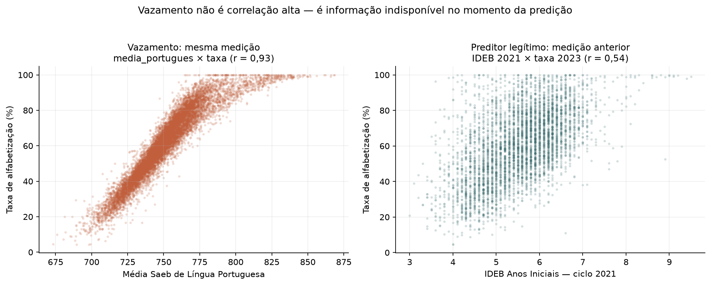
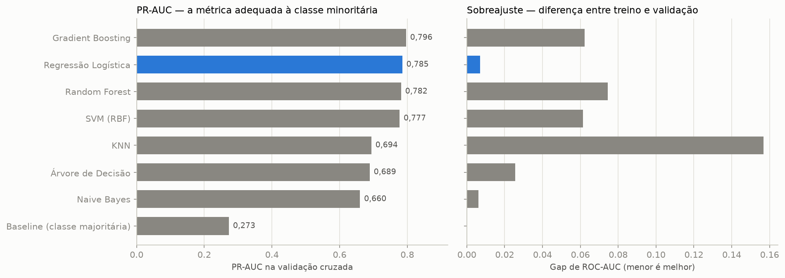
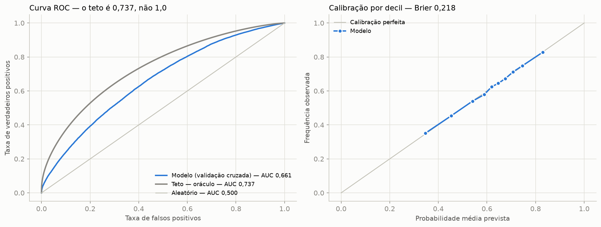
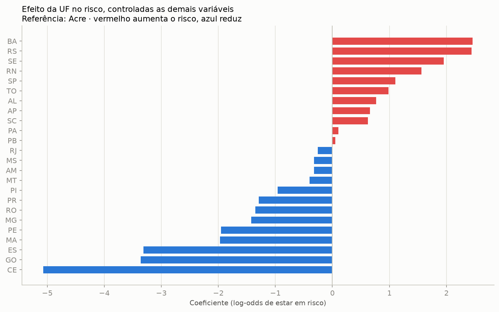
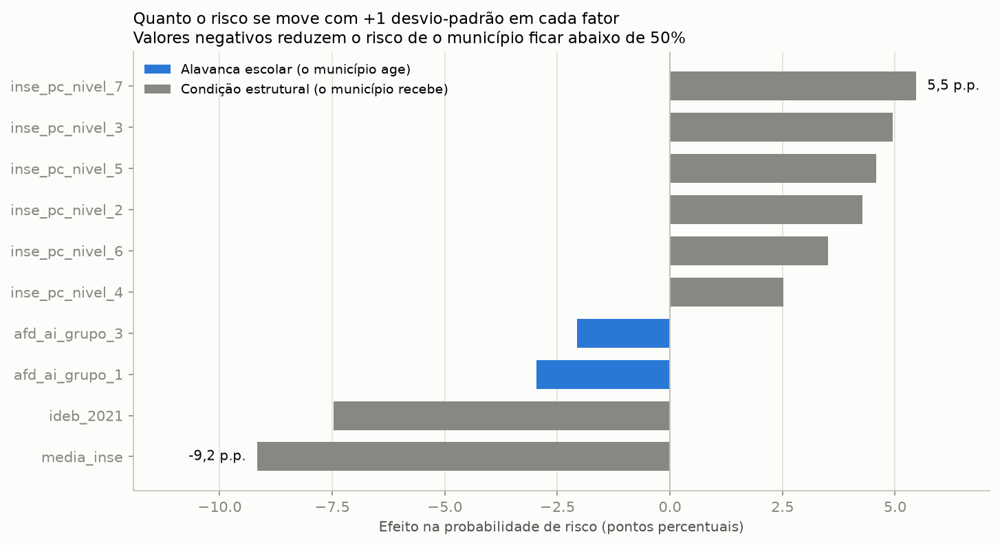
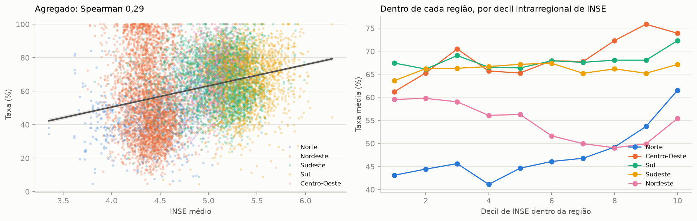
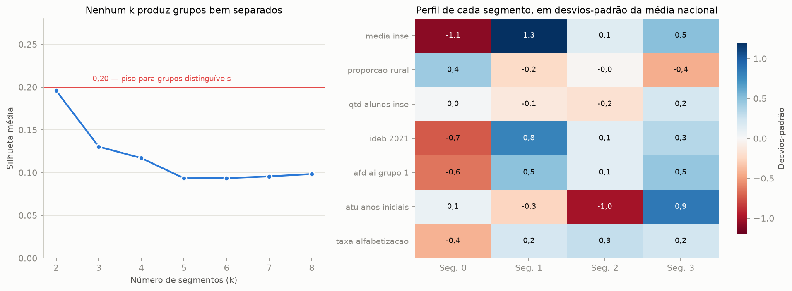
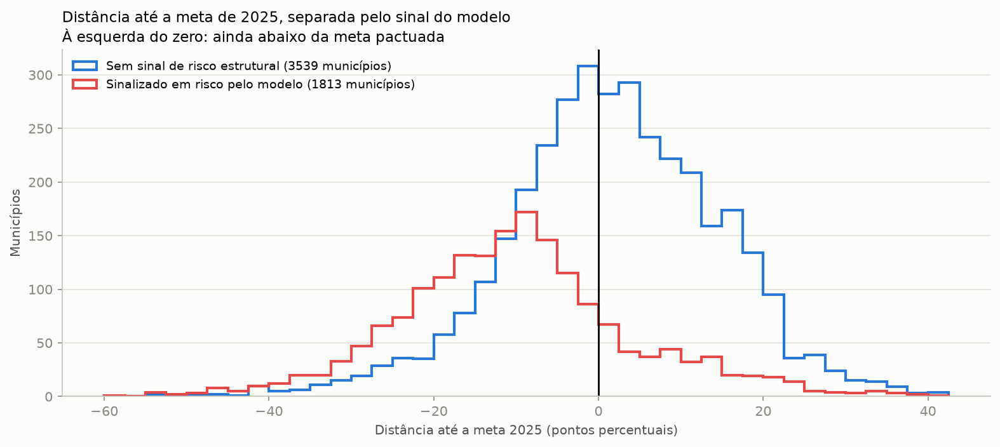

# Tech Challenge — Predição e Inteligência Analítica para Alfabetização no Brasil

> **POSTECH AI Scientist — Tech Challenge Fase 3**
> Continuidade direta da pipeline de engenharia de dados da Fase 2, agora aplicada a
> Machine Learning supervisionado.

Modelo supervisionado que estima a probabilidade de um aluno do 2º ano do ensino fundamental
estar alfabetizado, a partir de variáveis educacionais, territoriais e socioeconômicas dos
5.500 municípios brasileiros com rede municipal avaliada.

**O achado central:** depois de controlar desempenho pregresso, nível socioeconômico, formação
docente, tamanho de turma, esforço docente, ruralidade e porte, **a unidade federativa continua
sendo o fator mais importante do modelo** — e estar no Ceará multiplica por **5,1** a chance de
um aluno estar alfabetizado. O que separa os municípios brasileiros não é principalmente a renda
das famílias; é a política pública que cada estado executa.

---

## 1. Contexto do problema

A alfabetização na idade certa é o alicerce de toda a trajetória escolar. O **Compromisso
Nacional Criança Alfabetizada** mobiliza União, estados, Distrito Federal e municípios para
garantir que toda criança esteja alfabetizada ao fim do **2º ano do ensino fundamental**.

Para dar régua a essa política, o INEP definiu, com a avaliação **Alfabetiza Brasil** (2023), o
ponto de corte de **743 pontos na escala Saeb de Língua Portuguesa**: a criança que atinge esse
patamar é considerada alfabetizada. Daí nasce o **Indicador Criança Alfabetizada (ICA)** — o
percentual de estudantes que alcançam essa proficiência — com metas pactuadas por UF e por
município.

O indicador diz **onde estamos**. Não diz **por quê**, nem **onde intervir primeiro**. Gestores
públicos precisam antecipar risco, identificar territórios vulneráveis e entender quais fatores
efetivamente movem o resultado — e é aí que a Ciência de Dados transforma dado público em
inteligência aplicada à decisão.

## 2. Objetivo analítico

Desenvolver um **modelo supervisionado** que preveja se um aluno será considerado alfabetizado
ou não alfabetizado, e usá-lo para responder a cinco perguntas de negócio:

1. Quais fatores mais impactam a alfabetização?
2. Quais municípios apresentam maior risco educacional?
3. Quais regiões possuem padrões semelhantes?
4. Como prever municípios que podem não atingir as metas futuras?
5. Quais variáveis possuem maior influência no modelo?

### A ponte entre o dado disponível e a pergunta

O enunciado pergunta por **aluno**; a base pública é agregada por **município** — não existem
microdados individuais do ICA. A ponte é o **dado binário agrupado** (*grouped binary data*),
formato que a regressão logística binomial estima nativamente: cada linha município × ano vira
duas observações com o mesmo vetor de características, uma com `y = 1` e peso igual à fração
alfabetizada, outra com `y = 0` e peso igual à fração restante.

A verossimilhança resultante é idêntica à de uma logística ajustada sobre os alunos individuais
daquele município, e a probabilidade prevista lê-se diretamente como *"probabilidade de um aluno
daquele município estar alfabetizado"*. A contrapartida é a **falácia ecológica**, declarada na
seção 9.

## 3. Descrição da base utilizada

### 3.1 Fontes

| Origem | Conteúdo | Papel |
|---|---|---|
| **INEP / Base dos Dados** (5 CSVs) | Indicador Criança Alfabetizada por município e UF; metas Brasil, UF e município | base da Fase 2 — alvo e metas |
| **Censo Escolar — AFD** (2023, 2024) | Adequação da Formação Docente, % por grupo de formação | enriquecimento |
| **Censo Escolar — ATU** (2023, 2024) | Média de Alunos por Turma | enriquecimento |
| **Censo Escolar — IED** (2023, 2024) | Esforço Docente, % por nível | enriquecimento |
| **Saeb — INSE** (2023) | Nível Socioeconômico municipal e distribuição por nível | enriquecimento |
| **IDEB Anos Iniciais** (ciclo 2021) | IDEB, notas e taxa de aprovação | preditor defasado |

O enriquecimento **não foi opcional**. Como mostra a seção 4, quase toda coluna numérica do
arquivo original do INEP vaza o alvo; sem as fontes externas restariam ~4 variáveis legítimas e
o problema não seria modelável.

### 3.2 Pipeline medalhão, reproduzida localmente

A Fase 2 construiu a arquitetura **Bronze → Silver → Gold** em AWS Glue + S3 + Athena. A Fase 3
a reproduz em **Python/pandas, sem nenhuma dependência de nuvem**, preservando a semântica:
schema explícito, hash de deduplicação, regras de qualidade com quarentena, particionamento
Hive-style por ano e escrita idempotente.

```
data/lake/
├── bronze/<entidade>/ano=YYYY/                    # ingestão fiel + linhagem
├── silver/pass/<entidade>/ano=YYYY/               # limpo, deduplicado, validado
├── silver/quarentena/<entidade>/anomesdia=.../    # reprovados, com motivo
└── gold/<visao>/ano=YYYY/                         # 4 visões da Fase 2 + base de ML
```

| Camada | Resultado |
|---|---|
| **Bronze** | 10 entidades, **719.757 registros**, score de qualidade 100% |
| **Silver** | **54.165 duplicatas removidas** e **890 registros em quarentena** — todos do arquivo do INSE, que repete a mesma chave até 7 vezes |
| **Gold** | 5 visões, entre elas a `base_ml_alfabetizacao` |
| **Idempotência** | verificada nas três camadas: 29/29, 30/30 e 10/10 partições idênticas em duas execuções |

A duplicidade do INSE ilustra por que a Bronze guarda o dado como ele chega: a duplicata virou
um **número auditável** em vez de sumir silenciosamente numa leitura. Sem removê-la, o join
teria multiplicado por até 7 as linhas de cada município.

### 3.3 A base analítica

**`base_ml_alfabetizacao`** — grão município × ano, rede municipal, ciclos 2023 e 2024.

- **10.896 linhas × 38 colunas**, 5.500 municípios, **25 das 27 UFs**
- **Alvo:** `taxa_alfabetizacao` (média 60,3% em 2023 e 62,8% em 2024)
- **Preditores (36):** território (UF, capital/interior), formação docente, tamanho de turma,
  esforço docente, nível socioeconômico, ruralidade, porte e desempenho pregresso (IDEB 2021)

A rede municipal foi escolhida por ser a única com o mesmo número de municípios nos dois ciclos
(5.448) — condição para um split temporal sem viés de composição — e por ser a rede sob gestão
direta do município, destinatário das recomendações.

## 4. Etapas de modelagem

### 4.1 Tratamento de data leakage — feito na camada de dados

Este é o ponto mais delicado do projeto. O arquivo do INEP traz colunas que parecem excelentes
preditoras e não são: elas **são a mesma medição que gerou o alvo**. O grau de vazamento foi
**medido**, não presumido:

| Coluna | Por que vaza | Correlação com o alvo |
|---|---|---:|
| `media_portugues` | mesma escala Saeb da qual a taxa é o % de alunos com 743+ pontos | **0,927** |
| `proporcao_aluno_nivel_*` | distribuição de proficiência da qual a taxa deriva | **0,986** (soma dos níveis 5-8) |
| `meta_alfabetizacao_2025` | a meta é calculada a partir da taxa observada em 2023 | **0,966** |
| `nivel_alfabetizacao` | a própria taxa discretizada em faixas | — |
| IDEB dos ciclos **2023 e 2025** | contemporâneo e posterior ao alvo | — |

São **23 colunas excluídas**, listadas com o motivo de cada uma em
[`src/preprocessing/config.py`](src/preprocessing/config.py) e removidas programaticamente por
`gold.montar_base_ml()`. A decisão fica auditável no repositório em vez de depender de alguém
lembrar de excluí-la no notebook — e um `assert` no notebook 01 verifica que nenhuma sobreviveu.



O critério não é a força da correlação, e sim: *esta informação estaria disponível no momento em
que a predição precisaria ser feita?* Por isso `media_portugues` (r = 0,93) sai e o IDEB de 2021
(r = 0,54) fica — o segundo foi publicado dois anos antes do primeiro ciclo do alvo.

### 4.2 Pipeline do Scikit-learn

Todo o pré-processamento vive **dentro** do objeto `Pipeline`
([`src/modeling/features.py`](src/modeling/features.py)):

| Ramo | Tratamento | Motivo |
|---|---|---|
| Numéricas gerais | mediana → `StandardScaler` | escalas incomparáveis (de 3 a 80.160 contra 4 a 6): sem padronizar, a penalidade L2 puniria arbitrariamente as variáveis de escala pequena |
| Bloco IDEB | mediana **com `add_indicator=True`** → `StandardScaler` | não ter IDEB divulgado é sinal, não ruído — a ausência se concentra em municípios pequenos e isolados |
| Categóricas | moda → `OneHotEncoder(drop="first")` | *dummy encoding*: remove uma categoria para evitar multicolinearidade entre as dummies |

Como tudo está no `Pipeline`, a mediana da imputação, a média e o desvio da padronização e as
categorias do encoder são calculados **apenas com o fold de treino**. Padronizar antes de separar
os folds usaria estatísticas do conjunto de validação — vazamento silencioso, que não gera erro
nenhum e infla a métrica.

### 4.3 Engenharia de atributos

Três decisões vieram diretamente da análise exploratória:

- **Blocos composicionais.** AFD, IED e os níveis do INSE são percentuais que somam 100%, o que
  cria colinearidade perfeita. Descartamos uma **categoria de referência** por bloco
  (`afd_ai_grupo_5`, `ied_ai_nivel_1`, `inse_pc_nivel_1`), de modo que cada coeficiente se lê
  como "efeito de deslocar um ponto percentual da referência para esta categoria".
- **Redundância no bloco IDEB.** `ideb`, `nota_portugues` e `nota_matematica` correlacionam entre
  si 0,953-0,961; `indicador_rendimento` e `taxa_aprovacao` correlacionam **0,996**. Ficaram
  apenas `ideb_2021` e `taxa_aprovacao_2021`.
- **`regiao` e `ano` fora do modelo.** `regiao` é função determinística de `sigla_uf` — as
  dummies de UF já a codificam. `ano` sairia porque o teste temporal treina só em 2023.

### 4.4 Validação

| Estratégia | Papel |
|---|---|
| **`GroupKFold` por `id_municipio`** (5 folds) | validação principal — o mesmo município tem correlação 0,64 entre seus dois ciclos; deixá-lo atravessar a fronteira treino/validação permitiria que o modelo o memorizasse |
| **Split temporal 2023 → 2024** | generalização para um ciclo futuro, reportado **com e sem o Rio Grande do Sul** |
| **Busca em grade em `C`** | otimização, com score de treino ao lado do de validação para diagnosticar overfitting |
| `random_state` fixo | replicabilidade |

> **Nota técnica.** A validação é um laço explícito em
> [`src/evaluation/metricas.py`](src/evaluation/metricas.py), e não uma chamada direta a
> `GridSearchCV`. Com alvo binomial ponderado, cada município gera duas linhas idênticas em `X`
> com rótulos opostos: um scorer que ignore `sample_weight` devolve **AUC exatamente 0,5**,
> qualquer que seja o modelo. Fazer o peso chegar ao scorer exigiria ativar o *metadata routing*
> e declará-lo em cada etapa aninhada do `ColumnTransformer`. O laço explícito é mais curto e não
> deixa dúvida sobre onde o peso entra — no ajuste e na avaliação.

## 5. Escolha do algoritmo

**Regressão Logística com regularização L2.**

1. **O alvo é literalmente binomial.** Dado binário agrupado com `sample_weight` é exatamente o
   que uma logística binomial estima — não é uma adaptação.
2. **Coeficientes em *odds ratio* falam a língua do gestor.** "Estar no Ceará multiplica por 5 a
   chance" sustenta uma decisão de política pública; uma importância relativa de árvore não.
3. **A saída é calibrada** e pode ser lida como taxa esperada — verificado empiricamente.
4. **O valor do projeto está na explicação, não no ganho marginal de métrica.**

### A comparação medida

Argumento não é evidência. Todos os candidatos foram avaliados pelo **mesmo** pré-processamento,
a mesma validação ponderada e a mesma partição — só o estimador muda:

| Modelo | ROC-AUC | Brier | Gap treino-validação | Tempo (s) | % do teto |
|---|---:|---:|---:|---:|---:|
| Gradient Boosting | 0,6631 | 0,2178 | 0,0140 | 32,2 | 68,8 |
| **Regressão Logística** | **0,6611** | **0,2182** | **0,0015** | **0,5** | 67,9 |
| Random Forest | 0,6575 | 0,2194 | 0,0276 | 2,6 | 66,4 |
| Naive Bayes | 0,6414 | 0,3314 | 0,0009 | 0,4 | 59,6 |
| Árvore de Decisão | 0,6400 | 0,2217 | 0,0055 | 0,8 | 59,0 |
| Baseline (taxa média) | 0,5000 | 0,2367 | 0,0000 | 0,3 | 0,0 |



**O Gradient Boosting vence por 0,002 — dentro do desvio-padrão (0,003).** É empate estatístico,
ao custo de 64× mais tempo, gap treino-validação 9× maior e toda a interpretabilidade. O **Naive
Bayes** confirma o descarte a priori de forma mais grave que o previsto: Brier de 0,331, **pior
que o baseline**, com probabilidades completamente descalibradas — exatamente o que se espera de
uma premissa de independência aplicada a três blocos composicionais.

**E o achado que vale mais que a escolha do vencedor:** nenhum algoritmo passa de **68,8% do
intervalo piso→teto**. Cinco famílias diferentes, do linear ao boosting, param no mesmo lugar —
**a limitação é a informação disponível, não a capacidade de modelo.** É a justificativa
quantitativa das evoluções futuras: microdados de aluno e variáveis de política moveriam o
resultado; um sexto algoritmo, não.

Ficam de fora por **impossibilidade técnica**, não por preferência: o **SVM**, porque o `SVC` não
produz probabilidade calibrada nativamente e é O(n²) em 21.792 observações; e qualquer estimador
que não aceite `sample_weight`, já que o alvo depende inteiramente do peso.

**Decisão:** a Regressão Logística fica — não por ser a melhor no AUC, mas porque empata com a
melhor dentro do desvio, sobreajusta menos, calibra melhor e é a única que responde "por quê".
Para a pergunta de segmentação usamos **K-means**, representando a frente de aprendizado não
supervisionado.

## 6. Métricas de avaliação

A acurácia seria enganosa: como a taxa média é 61,5%, um modelo que classifique quase todos como
"alfabetizado" já acerta a maioria. As métricas escolhidas respondem ao uso real:

| Métrica | O que responde |
|---|---|
| **AUC-ROC** | o modelo **ordena** municípios por risco? (priorização) |
| **Brier score / calibração** | a probabilidade prevista pode ser lida como **taxa esperada**? (dimensionamento) |
| **KS** | quanto do espaço de probabilidade separa os dois grupos? |
| **Log loss** | a função efetivamente otimizada |

### O teto de 0,737 — e por que ele importa

Dados agregados impõem um limite ao poder de discriminação: dentro de um município, todos os
alunos têm o mesmo vetor de características, e nenhum modelo consegue distinguir a criança
alfabetizada da não alfabetizada da mesma escola. Medimos esse teto com um **oráculo** — um
"modelo" que já conhece a taxa observada e a usa como predição.

| Referência | AUC | Brier |
|---|---:|---:|
| Piso — prever a média nacional para todos | 0,500 | 0,237 |
| **Modelo — Regressão Logística (`GroupKFold`)** | **0,661** | **0,218** |
| Teto — oráculo com a taxa observada | 0,737 | 0,198 |

**O modelo percorre 67,9% do intervalo entre o piso e o teto** usando apenas informação
disponível *antes* de a avaliação acontecer.

## 7. Interpretação dos resultados

### Desempenho

| Teste | AUC | Leitura |
|---|---:|---|
| `GroupKFold` por município (5 folds) | **0,661** | generaliza para municípios não vistos |
| Split temporal 2023 → 2024, todas as UFs | 0,642 | generaliza para um ciclo futuro |
| Split temporal 2023 → 2024, **sem o RS** | **0,672** | **acima da própria validação cruzada** |

A diferença entre treino e validação é de **0,0015** — o modelo não apresenta overfitting, o que
é esperado com 21.792 observações para 53 features em um modelo linear. A regularização L2 é uma
salvaguarda contra colinearidade residual, não um remédio para sobreajuste.



A calibração fica sobre a diagonal: quando o modelo prevê 40%, a frequência observada é próxima
de 40%. É isso que permite ler a saída como taxa esperada, e não apenas como ordenação.

### Interpretabilidade — três lentes que convergem

| | Coeficientes | Permutation Importance | SHAP |
|---|---|---|---|
| 1º | `sigla_uf_CE` (1,62) | `sigla_uf` (0,080) | `ideb_2021` (0,217) |
| 2º | `ideb_2021` (0,285) | `ideb_2021` (0,042) | `sigla_uf_CE` (0,131) |
| 3º | `media_inse` (0,118) | `media_inse` (0,007) | `media_inse` (0,105) |



Depois de controlar tudo o que se consegue medir, **o Ceará multiplica por 5,06 a chance de um
aluno estar alfabetizado**. Embaralhar `sigla_uf` derruba o AUC em 0,080 — quase o dobro do IDEB
e dez vezes o nível socioeconômico.

### Em pontos percentuais, para decisão



| Fator | Efeito de +1 desvio-padrão | Natureza |
|---|---:|---|
| IDEB 2021 | **+5,5 p.p.** | condição estrutural |
| Nível socioeconômico (INSE) | **+2,5 p.p.** | condição estrutural |
| Tamanho de turma nos anos iniciais | **−1,5 p.p.** | alavanca escolar |
| Docentes com licenciatura na área | **+1,3 p.p.** | alavanca escolar |

## 8. Insights encontrados

**1. A política estadual supera a condição socioeconômica.** Ceará e Pernambuco têm INSE
praticamente idêntico (4,37) e taxas de **90,1% contra 63,0%** — 27 pontos que a renda não
explica. O Ceará supera todas as UFs do Sul e do Sudeste com nível socioeconômico muito inferior.

**2. O efeito socioeconômico é, em boa parte, geográfico.** No agregado, o INSE correlaciona 0,29
com o alvo. Dentro de cada região: Norte 0,31 | Centro-Oeste 0,20 | Sul 0,04 | Sudeste 0,01 |
**Nordeste −0,14**. É um paradoxo de Simpson — o decil nacional de INSE é quase um rótulo de
região (os decis 7 a 10 não contêm *nenhum* município do Nordeste).



**3. O Rio Grande do Sul sofreu uma quebra estrutural em 2024.** Todas as regiões melhoraram,
exceto o Sul — puxado pelo RS isolado: **−20,2 p.p.**, com 89,6% dos municípios em queda e metade
perdendo mais de 20 pontos. A hipótese (não verificável com esta base) são as enchentes de
abril-maio de 2024. O modelo **detectou o choque sozinho**: o resíduo médio do estado vai de
+10,1 em 2023 para −10,3 em 2024.

**4. Não existem "regiões com padrões semelhantes" — existem perfis que atravessam as regiões.**
A silhueta do K-means não passa de 0,20 para nenhum `k` entre 2 e 8: os perfis municipais formam
um **contínuo**, não grupos naturais. Adotando 4 segmentos como convenção descritiva, o segmento
de maior vulnerabilidade (taxa média 54,8%) aparece em **24 das 25 UFs**, e cada região contém 3
ou 4 dos 4 segmentos.



**5. Um ranking de "pior gestão" não é estatisticamente defensável.** A lista dos 300 municípios
com pior resíduo em 2023 tem **17,3% de coincidência** com a mesma lista em 2024 (correlação
0,28). A taxa observada é o dobro de estável (35,7%; correlação 0,64). Publicar a primeira como
avaliação de gestão seria irresponsável — quatro em cada cinco nomes mudariam no ciclo seguinte.

## 9. Limitações do projeto

1. **Falácia ecológica.** O modelo estima a probabilidade de um aluno *típico* de um município,
   não de uma criança específica. Nenhuma característica individual entra.
2. **Ausência de variáveis de política educacional.** É a lacuna mais séria: o maior efeito do
   modelo — a dummy do Ceará — é justamente o que ele **não consegue explicar**, só medir.
   Formação continuada, material estruturado e regime de colaboração não estão na base.
3. **Peso por município, não por aluno.** Cada município conta 1, independentemente do porte; a
   base não traz o número de alunos avaliados.
4. **Cobertura territorial incompleta.** 25 das 27 UFs e 5.500 dos 5.570 municípios: o Distrito
   Federal não tem rede municipal e **Roraima está ausente do arquivo do INEP** nos dois ciclos.
5. **INSE de 2023 replicado para 2024**, tratado como atributo estrutural do município.
6. **AFD, ATU e IED usam o agregado `Total`**, que inclui a rede privada, enquanto o alvo é da
   rede municipal — são medidas de contexto do município, não da rede.
7. **Apenas dois ciclos avaliativos.** Tendência e choque são indistinguíveis; o caso do Rio
   Grande do Sul é o exemplo mais claro. Também inviabiliza modelos de série temporal.
8. **Correlação não é causalidade.** Todos os efeitos são associações condicionais. Nenhuma
   intervenção pode ser justificada apenas por estes coeficientes.

## 10. Aplicação prática para políticas públicas

### Priorização de municípios

| Uso | Recomendado? | Por quê |
|---|---|---|
| Priorizar pela **taxa observada** | **Sim** | estável entre ciclos e ligado ao objetivo da política |
| Ranquear pelo **resíduo de um ciclo** | **Não** | 17% de estabilidade — produziria lista quase aleatória |
| Monitorar **resíduo agregado** por UF/segmento | **Sim** | o ruído individual se cancela; detectou o choque do RS |
| Usar o resíduo como **triagem** | Com ressalva | serve para escolher onde olhar, nunca como veredito sobre um gestor |

### Metas: transformando um número em decisão de orçamento

Em 2024, **43,4% dos municípios já cumpriam a meta pactuada para 2025**. Dos 3.030 restantes, o
modelo separa dois grupos com diagnósticos opostos:

| Situação | Municípios | Distância mediana | Resposta de política |
|---|---:|---:|---|
| A estrutura **sustenta** a meta | **678** | 6,8 p.p. | apoio à execução — falta pouco |
| A estrutura **não sustenta** a meta | **2.352** | 11,5 p.p. | investimento estruturante — cobrar resultado sem mudar as condições é cobrar o impossível |



### Focalização por perfil, não por território

Como os segmentos atravessam as regiões, um programa desenhado por região erraria o alvo.
Municípios do interior de Minas Gerais, do sertão baiano e do interior do Pará podem compartilhar
o mesmo perfil e responder ao mesmo desenho de intervenção.

### A recomendação de maior retorno

O maior ganho disponível não está em nenhuma variável da base: está em **entender e replicar o
que o Ceará faz**. O modelo mede o tamanho do efeito (*odds ratio* 5,06) sem conseguir explicá-lo.
Essa é, ao mesmo tempo, a maior limitação do trabalho e a sua recomendação mais valiosa: **a
próxima rodada de dados precisa registrar o que os estados fazem, não apenas o que eles têm.**

## 11. Possíveis evoluções futuras

1. **Incorporar variáveis de política educacional** — formação continuada, material estruturado,
   regime de colaboração, programas estaduais. É o que transformaria o efeito do Ceará de
   inexplicável em explicável, e o modelo de descritivo em prescritivo.
2. **Microdados de aluno**, se e quando publicados, eliminariam a falácia ecológica e elevariam o
   teto de 0,737.
3. **Terceiro ciclo avaliativo** permitiria separar tendência de choque, modelar dinâmica e
   validar o modelo em duas transições temporais.
4. **Inferência causal** — diferenças-em-diferenças ou controle sintético sobre a adoção de
   programas estaduais, transformando associação em efeito estimado.
5. **Enriquecimento adicional**: FUNDEB (financiamento por aluno), Cadastro Único (vulnerabilidade
   familiar), Atlas do Desenvolvimento Humano e PNAD.
6. **Modelos não lineares como contraprova** — verificar quanto do gap até o teto de 0,737 é
   interação não capturada pela forma linear.
7. **Monitoramento em produção** — *data drift* e PSI sobre as variáveis de entrada a cada novo
   ciclo, com re-treino versionado.

---

## Estrutura do repositório

```
├── data/
│   ├── *.csv                          # 5 bases do INEP (Fase 2)
│   ├── external/*.xlsx                # Censo Escolar, INSE e IDEB
│   └── lake/                          # data lake local gerado (gitignored)
├── notebooks/
│   ├── 01_pipeline_medalhao.ipynb     # Bronze → Silver → Gold, DQ e idempotência
│   ├── 02_analise_exploratoria.ipynb  # EDA, correlações e hipóteses analíticas
│   ├── 03_modelagem.ipynb             # Pipeline sklearn, Regressão Logística, SHAP
│   └── 04_aplicacao_estrategica.ipynb # as cinco perguntas de negócio
├── src/
│   ├── preprocessing/                 # pipeline medalhão local
│   ├── modeling/                      # alvo binomial + pipeline do modelo
│   ├── evaluation/                    # métricas ponderadas e instrumentos de decisão
│   └── visualization/                 # estilo visual compartilhado
├── images/                            # figuras geradas pelos notebooks
├── reports/
│   ├── relatorio_tecnico.md           # decisões analíticas e metodologia
│   └── model_card.json                # ficha técnica gerada por código
├── requirements.txt
├── README.md
└── .gitignore
```

## Como executar

Pré-requisitos: Python 3.11+ e as bases já versionadas em `data/`.

```bash
python -m venv .venv
.venv/Scripts/pip install -r requirements.txt

# 1. Reconstrói o data lake local (Bronze → Silver → Gold)
.venv/Scripts/python -m src.preprocessing.run_pipeline

# 2. Regenera a ficha técnica do modelo (reports/model_card.json)
.venv/Scripts/python -m src.modeling.model_card

# 3. Execute os notebooks 01 a 04, nesta ordem
.venv/Scripts/jupyter lab
```

A pipeline é **idempotente**: pode ser reexecutada quantas vezes for necessário, produzindo
sempre o mesmo estado final. Nenhuma etapa exige credenciais, nuvem ou acesso à internet.

## Roteiro dos notebooks

| Notebook | Frente avaliada | Entrega |
|---|---|---|
| [01](notebooks/01_pipeline_medalhao.ipynb) | Engenharia de dados | pipeline medalhão, DQ, quarentena, tratamento de leakage e prova de idempotência |
| [02](notebooks/02_analise_exploratoria.ipynb) | Análise exploratória | distribuições, correlações, confundimento regional e 5 hipóteses analíticas |
| [03](notebooks/03_modelagem.ipynb) | Modelagem supervisionada | alvo binomial, `Pipeline`, otimização, validação e interpretabilidade |
| [04](notebooks/04_aplicacao_estrategica.ipynb) | Aplicação estratégica | as cinco perguntas de negócio respondidas |

Cada notebook segue o mesmo padrão: célula markdown explicando a **decisão**, código que a
executa e leitura do **resultado**. Todas as afirmações numéricas saem de células executadas.

## Documentação técnica

| Artefato | Conteúdo |
|---|---|
| [`reports/relatorio_tecnico.md`](reports/relatorio_tecnico.md) | decisões analíticas, metodologia, o que foi descartado e por quê, e as decisões revistas durante o projeto |
| [`reports/model_card.json`](reports/model_card.json) | ficha técnica **gerada por código** (`python -m src.modeling.model_card`): proveniência dos dados, features, hiperparâmetros, métricas, comparação de algoritmos e limitações |

O model card existe para que **nenhum número da documentação seja digitado à mão** — ele é
regenerado a cada execução, e o relatório técnico o referencia.

## Tecnologias

| Ferramenta | Papel |
|---|---|
| **pandas + PyArrow** | pipeline medalhão local em Parquet particionado |
| **Scikit-learn** | `Pipeline`, `ColumnTransformer`, Regressão Logística, K-means |
| **SHAP** | interpretabilidade por predição individual |
| **Matplotlib** | visualizações, com paleta validada para acessibilidade |
| **openpyxl** | leitura das planilhas do INEP com cabeçalho multi-nível |
