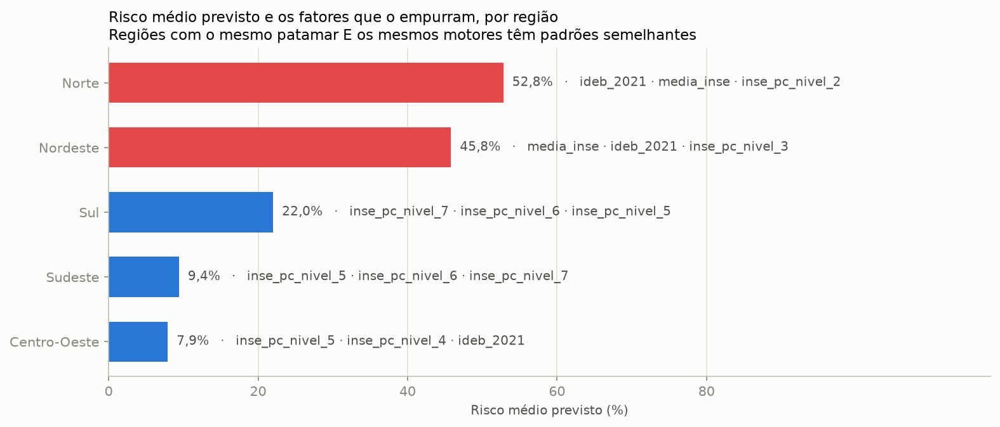

# Tech Challenge — Predição e Inteligência Analítica para Alfabetização no Brasil

> **POSTECH AI Scientist — Tech Challenge Fase 3**
> Continuidade direta da pipeline de engenharia de dados da Fase 2, agora aplicada a
> Machine Learning supervisionado.

Modelo supervisionado que estima o **risco de alfabetização** de cada um dos 5.448 municípios
brasileiros com rede municipal avaliada — e, por meio dele, a chance de uma criança daquele
território chegar alfabetizada ao fim do 2º ano.

**O achado central:** depois de controlar desempenho pregresso, nível socioeconômico, formação
docente, tamanho de turma, esforço docente, ruralidade e porte, **a unidade federativa continua
sendo o fator mais importante do modelo**. Embaralhar a UF derruba o PR-AUC em 0,345 — duas vezes
e meia o efeito do nível socioeconômico. Ceará e Bahia, vizinhos e com condições socioeconômicas
próximas, aparecem em polos opostos do modelo. O que separa os municípios brasileiros não é
principalmente a renda das famílias; é a política pública que cada estado executa.

---

## 1. Contexto do problema

A alfabetização na idade certa é o alicerce de toda a trajetória escolar. O **Compromisso
Nacional Criança Alfabetizada** mobiliza União, estados, Distrito Federal e municípios para
garantir que toda criança esteja alfabetizada ao fim do **2º ano do ensino fundamental**.

Para dar régua a essa política, o INEP definiu, com a avaliação **Alfabetiza Brasil** (2023), o
ponto de corte de **743 pontos na escala Saeb de Língua Portuguesa**: a criança que atinge esse
patamar é considerada alfabetizada. Daí nasce o **Indicador Criança Alfabetizada (ICA)** — o
percentual de estudantes que alcançam essa proficiência — com metas pactuadas por UF e por
município.

O indicador diz **onde estamos**. Não diz **por quê**, nem **onde intervir primeiro**. Gestores
públicos precisam antecipar risco, identificar territórios vulneráveis e entender quais fatores
efetivamente movem o resultado — e é aí que a Ciência de Dados transforma dado público em
inteligência aplicada à decisão.

## 2. Objetivo analítico

Desenvolver um **modelo supervisionado** que preveja se um aluno será considerado alfabetizado
ou não alfabetizado, e usá-lo para responder a cinco perguntas de negócio:

1. Quais fatores mais impactam a alfabetização?
2. Quais municípios apresentam maior risco educacional?
3. Quais regiões possuem padrões semelhantes?
4. Como prever municípios que podem não atingir as metas futuras?
5. Quais variáveis possuem maior influência no modelo?

### A ponte entre o dado disponível e a pergunta — por que modelamos o município

O enunciado pergunta por **aluno**. **Não existe microdado público de aluno em nenhuma das
fontes deste projeto** — e vale ser explícito sobre isso, porque é a restrição que define todo o
desenho da solução:

| Fonte | Grão mais fino disponível | Identificador de aluno? |
|---|---|---|
| Indicador Criança Alfabetizada (INEP) | município × ano × série × rede | não |
| Censo Escolar — AFD, ATU, IED | município × ano × localização × dependência | não |
| Saeb — INSE | município × tipo de rede × localização | não |
| IDEB Anos Iniciais | município × rede × ciclo | não |
| Metas do CNCA | município × rede | não |

Nenhuma traz sexo, idade, trajetória, frequência ou qualquer atributo individual — nem uma chave
que permitisse ligá-las entre si no grão do estudante. As fontes externas de enriquecimento têm
exatamente a mesma limitação: **todas são agregados municipais.**

**Por isso a alfabetização do aluno é tratada como dada pelo contexto do seu município.**
Analisamos os fatores **socioeconômicos, educacionais e políticos** do território — nível
socioeconômico das famílias, formação do corpo docente, tamanho das turmas, esforço docente,
ruralidade, porte, desempenho pregresso da rede e unidade federativa — para chegar à conclusão
sobre a chance de uma criança daquele lugar ser alfabetizada ou não.

O modelo classifica o município como **em risco** quando menos da metade das suas crianças chega
alfabetizada (`taxa < 50%`). A leitura para o aluno é direta: *uma criança que estuda num
município sinalizado em risco tem chance substancialmente menor de chegar alfabetizada*.

A contrapartida é a **falácia ecológica** — duas crianças do mesmo município recebem a mesma
predição —, declarada na seção 9.

## 3. Descrição da base utilizada

### 3.1 Fontes

| Origem | Conteúdo | Papel |
|---|---|---|
| **INEP / Base dos Dados** (5 CSVs) | Indicador Criança Alfabetizada por município e UF; metas Brasil, UF e município | base da Fase 2 — alvo e metas |
| **Censo Escolar — AFD** (2023, 2024) | Adequação da Formação Docente, % por grupo de formação | enriquecimento |
| **Censo Escolar — ATU** (2023, 2024) | Média de Alunos por Turma | enriquecimento |
| **Censo Escolar — IED** (2023, 2024) | Esforço Docente, % por nível | enriquecimento |
| **Saeb — INSE** (2023) | Nível Socioeconômico municipal e distribuição por nível | enriquecimento |
| **IDEB Anos Iniciais** (ciclo 2021) | IDEB, notas e taxa de aprovação | preditor defasado |

O enriquecimento **não foi opcional**. Como mostra a seção 4, quase toda coluna numérica do
arquivo original do INEP vaza o alvo; sem as fontes externas restariam ~4 variáveis legítimas e
o problema não seria modelável. Sem elas, a maior correlação disponível com o alvo seria a de
`ano` (0,06); com elas, 0,53.

### 3.2 Pipeline medalhão, reproduzida localmente

A Fase 2 construiu a arquitetura **Bronze → Silver → Gold** em AWS Glue + S3 + Athena. A Fase 3
a reproduz em **Python/pandas, sem nenhuma dependência de nuvem**, preservando a semântica:
schema explícito, hash de deduplicação, regras de qualidade com quarentena, particionamento
Hive-style por ano e escrita idempotente.

```
data/lake/
├── bronze/<entidade>/ano=YYYY/                    # ingestão fiel + linhagem
├── silver/pass/<entidade>/ano=YYYY/               # limpo, deduplicado, validado
├── silver/quarentena/<entidade>/anomesdia=.../    # reprovados, com motivo
└── gold/<visao>/ano=YYYY/                         # 4 visões da Fase 2 + base de ML
```

| Camada | Resultado |
|---|---|
| **Bronze** | 10 entidades, **719.757 registros**, score de qualidade 100% |
| **Silver** | **54.165 duplicatas removidas** e **890 registros em quarentena** — todos do arquivo do INSE, que repete a mesma chave até 7 vezes |
| **Gold** | 5 visões, entre elas a `base_ml_alfabetizacao` |
| **Idempotência** | verificada nas três camadas: 29/29, 30/30 e 10/10 partições idênticas em duas execuções |

A duplicidade do INSE ilustra por que a Bronze guarda o dado como ele chega: a duplicata virou
um **número auditável** em vez de sumir silenciosamente numa leitura. Sem removê-la, o join
teria multiplicado por até 7 as linhas de cada município.

### 3.3 A base analítica

**`base_ml_alfabetizacao`** — grão município × ano, rede municipal, ciclos 2023 e 2024:
**10.896 linhas × 38 colunas**, 5.500 municípios, **25 das 27 UFs**.

A modelagem consome dela o recorte de **2024**: **5.448 municípios, uma linha cada**, dos quais
**1.486 (27,3%) estão em risco**.

- **Alvo:** `em_risco = taxa_alfabetizacao < 50%`
- **Preditores (36):** território (UF, capital/interior), formação docente, tamanho de turma,
  esforço docente, nível socioeconômico, ruralidade, porte e desempenho pregresso (IDEB 2021)

A rede municipal foi escolhida por ser a única com o mesmo número de municípios nos dois ciclos
(5.448) e por ser a rede sob gestão direta do município, destinatário das recomendações.

### 3.4 Limitações da base

Três restrições moldaram o projeto inteiro e reaparecem na seção 9:

1. **Não há microdado de aluno** — nenhuma fonte desce abaixo do município (seção 2).
2. **Só existem dois ciclos avaliativos** (2023 e 2024), e um deles contém um choque exógeno: o
   Rio Grande do Sul caiu **20,2 p.p.** entre eles. Modelamos um único ciclo por isso — e o
   risco previsto para o RS fica **superestimado**, o que declaramos abertamente.
3. **Nenhuma variável de política educacional.** A base descreve o que o município *tem*, nunca
   o que ele *faz*. É a lacuna que o maior achado do projeto expõe.

## 4. Etapas de modelagem

### 4.1 Tratamento de data leakage — feito na camada de dados

Este é o ponto mais delicado do projeto. O arquivo do INEP traz colunas que parecem excelentes
preditoras e não são: elas **são a mesma medição que gerou o alvo**. O grau de vazamento foi
**medido**, não presumido:

| Coluna | Por que vaza | Correlação com o alvo |
|---|---|---:|
| `media_portugues` | mesma escala Saeb da qual a taxa é o % de alunos com 743+ pontos | **0,927** |
| `proporcao_aluno_nivel_*` | distribuição de proficiência da qual a taxa deriva | **0,986** (soma dos níveis 5-8) |
| `meta_alfabetizacao_2025` | a meta é calculada a partir da taxa observada em 2023 | **0,966** |
| `nivel_alfabetizacao` | a própria taxa discretizada em faixas | — |
| IDEB dos ciclos **2023 e 2025** | contemporâneo e posterior ao alvo | — |

São **23 colunas excluídas**, listadas com o motivo de cada uma em
[`src/preprocessing/config.py`](src/preprocessing/config.py) e removidas programaticamente por
`gold.montar_base_ml()`. A decisão fica auditável no repositório em vez de depender de alguém
lembrar de excluí-la no notebook — e um `assert` no notebook 01 verifica que nenhuma sobreviveu.


O critério não é a força da correlação, e sim: *esta informação estaria disponível no momento em
que a predição precisaria ser feita?* Por isso `media_portugues` (r = 0,93) sai e o IDEB de 2021
(r = 0,54) fica — o segundo foi publicado dois anos antes do ciclo modelado.

**A meta pactuada também não entra no modelo.** Ela reaparece só na seção 10, como régua de
comparação *depois* da predição.

### 4.2 Pipeline do Scikit-learn

Todo o pré-processamento vive **dentro** do objeto `Pipeline`
([`src/modeling/features.py`](src/modeling/features.py)):

| Ramo | Tratamento | Motivo |
|---|---|---|
| Numéricas gerais | mediana → `StandardScaler` | escalas incomparáveis (de 3 a 80.160 contra 4 a 6): sem padronizar, a penalidade L2 puniria arbitrariamente as variáveis de escala pequena |
| Bloco IDEB | mediana **com `add_indicator=True`** → `StandardScaler` | não ter IDEB divulgado é sinal, não ruído — a ausência se concentra em municípios pequenos e isolados, e o indicador confirma, com OR 1,32 |
| Categóricas | moda → `OneHotEncoder(drop="first")` | *dummy encoding*: remove uma categoria para evitar multicolinearidade entre as dummies |

Como tudo está no `Pipeline`, a mediana da imputação, a média e o desvio da padronização e as
categorias do encoder são calculados **apenas com o fold de treino**. Padronizar antes de separar
os folds usaria estatísticas do conjunto de validação — vazamento silencioso, que não gera erro
nenhum e infla a métrica.

### 4.3 Engenharia de atributos

Três decisões vieram diretamente da análise exploratória:

- **Blocos composicionais.** AFD, IED e os níveis do INSE são percentuais que somam 100%, o que
  cria colinearidade perfeita. Descartamos uma **categoria de referência** por bloco
  (`afd_ai_grupo_5`, `ied_ai_nivel_1`, `inse_pc_nivel_1`), de modo que cada coeficiente se lê
  como "efeito de deslocar um ponto percentual da referência para esta categoria".
- **Redundância no bloco IDEB.** `ideb`, `nota_portugues` e `nota_matematica` correlacionam entre
  si 0,953-0,961; `indicador_rendimento` e `taxa_aprovacao` correlacionam **0,996**. Ficaram
  apenas `ideb_2021` e `taxa_aprovacao_2021`.
- **`regiao` e `ano` fora do modelo.** `regiao` é função determinística de `sigla_uf` — as
  dummies de UF já a codificam. `ano` é constante no ciclo modelado.

**28 colunas de entrada → 53 features após o pré-processamento.**

### 4.4 Validação

Com uma linha por município, não há peso amostral a rotear nem grupos a preservar: a validação é
a padrão do Scikit-learn.

| Etapa | Estratégia | Pergunta que responde |
|---|---|---|
| Partição | `train_test_split` **estratificado** 75/25 | quanto o modelo erra em municípios que nunca viu? |
| Seleção e ajuste | `StratifiedKFold` de 5 folds **sobre o treino** | qual algoritmo e qual regularização, sem tocar no teste? |
| Busca | `GridSearchCV` sobre `C`, otimizando PR-AUC | quanta regularização? |
| — | `random_state = 42` em toda parte | replicabilidade |

Estratificado nas duas etapas porque a classe de risco é minoritária (27,3%). O conjunto de teste
(**1.362 municípios**) é tocado **uma única vez**, no fim do notebook 03.

## 5. Escolha do algoritmo

**Regressão Logística com regularização L2.**

1. **Coeficientes em *odds ratio* falam a língua do gestor.** "Estar neste grupo dobra o risco"
   sustenta uma decisão de política pública; uma importância relativa de árvore não.
2. **A saída é calibrada** e pode ser lida como probabilidade de risco — verificado
   empiricamente, e é isso que autoriza escolher o limiar por cobertura (seção 10).
3. **O valor do projeto está na explicação, não no ganho marginal de métrica.**

### A comparação medida

Argumento não é evidência. Os oito candidatos foram avaliados pelo **mesmo** pré-processamento, a
mesma validação estratificada e a mesma partição — só o estimador muda. As métricas são
**independentes de limiar**, porque o corte de decisão só é escolhido depois:

| Modelo | ROC-AUC | PR-AUC | Gap treino-validação |
|---|---:|---:|---:|
| Gradient Boosting | 0,8974 | **0,7964** | 0,0623 |
| **Regressão Logística** | **0,9027** | 0,7853 | **0,0070** |
| Random Forest | 0,8859 | 0,7817 | 0,0745 |
| SVM (RBF) | 0,8873 | 0,7772 | 0,0613 |
| KNN | 0,8433 | 0,6938 | 0,1567 |
| Árvore de Decisão | 0,8450 | 0,6889 | 0,0256 |
| Naive Bayes | 0,8575 | 0,6602 | 0,0060 |
| Baseline (classe majoritária) | 0,5000 | 0,2729 | 0,0000 |


**A Regressão Logística tem o melhor ROC-AUC do conjunto** e fica a 0,011 do melhor PR-AUC —
e sobreajusta quase dez vezes menos que os ensembles (0,0070 contra 0,0623 e 0,0745). Não é o
caso de argumentar "empata e é mais simples": ela lidera a métrica de ordenação.

**E o achado que vale mais que a escolha do vencedor:** sete famílias diferentes — do linear ao
boosting, do baseado em distância ao probabilístico — param na mesma faixa de PR-AUC (0,66 a
0,80). **A limitação é a informação disponível, não a capacidade de modelo.** É a justificativa
quantitativa das evoluções futuras: microdados de aluno e variáveis de política moveriam o
resultado; um oitavo algoritmo, não.

**`class_weight="balanced"` foi testado e rejeitado.** Diante de uma classe minoritária seria o
reflexo natural, mas ele não altera o ROC-AUC (0,879 nos dois casos) e **piora a calibração em
2,5×** (desvio 0,111 contra 0,045). Como a saída precisa ser lida como probabilidade, o
desbalanceamento é tratado na **escolha do limiar**, não no peso das classes.

## 6. Métricas de avaliação

A acurácia seria enganosa: como 72,7% dos municípios não estão em risco, um modelo que responda
"fora de risco" para todo mundo já acerta quase três em cada quatro. Ela é reportada **sempre ao
lado desse baseline**, justamente para deixar claro que sozinha não diz nada.

| Métrica | O que responde |
|---|---|
| **Recall da classe de risco** | a prioritária. Um falso alarme custa uma visita técnica; um falso negativo custa uma geração |
| **PR-AUC** | mais informativa que a ROC quando a classe de interesse é minoritária — não se infla com os verdadeiros negativos, que aqui são maioria |
| **ROC-AUC** | o modelo **ordena** municípios por risco? (priorização) |
| **Curva de calibração** | a probabilidade prevista é confiável, e não só a ordem? (dimensionamento) |

### Resultado no conjunto de teste

1.362 municípios nunca vistos:

| Métrica | Valor |
|---|---:|
| **ROC-AUC** | **0,880** |
| **PR-AUC** | **0,693** |
| Recall da classe de risco | 0,577 |
| Precisão da classe de risco | 0,679 |
| Acurácia | 0,811 |
| *Acurácia do baseline* | *0,728* |


O recall de 0,577 é do limiar padrão de 0,5, que **não é o limiar de operação** — a seção 10
mostra como escolhê-lo a partir da cobertura desejada.

## 7. Interpretação dos resultados

### Ajuste e generalização

A busca em grade adotou **`C = 10,0`**, com diferença treino-validação de **0,0070** — o modelo
não apresenta overfitting, o que é esperado com 4.086 municípios de treino para 53 features num
modelo linear. A regularização L2 é salvaguarda contra colinearidade residual, não remédio para
sobreajuste.


A calibração fica sobre a diagonal: quando o modelo prevê 40% de risco, a frequência observada é
próxima de 40%. É isso que permite ler a saída como probabilidade, e não apenas como ordenação.

### Interpretabilidade — três lentes que convergem

Os valores são **para a classe de risco**: OR abaixo de 1 significa *reduz* o risco.

| | Coeficientes (OR de risco) | Permutation Importance | SHAP |
|---|---|---|---|
| 1º | `sigla_uf_CE` — **0,006** | `sigla_uf` — **0,345** | `media_inse` — 0,816 |
| 2º | `sigla_uf_BA` — 11,68 | `media_inse` — 0,137 | `ideb_2021` — 0,664 |
| 3º | `media_inse` — 0,391 | `ideb_2021` — 0,103 | `sigla_uf_RS` — 0,468 |


As três lentes apontam o mesmo conjunto: **território, condição socioeconômica e desempenho
pregresso**. Depois de controlar tudo o que se consegue medir, o Ceará e a Bahia — estados
vizinhos, ambos no Nordeste — ficam em polos opostos do modelo. Embaralhar `sigla_uf` derruba o
PR-AUC em **0,345**, duas vezes e meia o efeito do nível socioeconômico.

### Em pontos percentuais, para decisão

Odds ratio é a unidade estatisticamente correta e a errada para uma reunião. O mesmo efeito, em
**pontos percentuais de risco** por desvio-padrão:


| Fator | Efeito no risco | Natureza |
|---|---:|---|
| Nível socioeconômico (INSE) | **−9,2 p.p.** | condição estrutural |
| IDEB 2021 | **−7,5 p.p.** | condição estrutural |
| Docentes com formação adequada | **−3,0 p.p.** | alavanca escolar |
| Docentes com formação parcialmente adequada | **−2,1 p.p.** | alavanca escolar |

A separação entre **o que o município recebe** e **o que o município faz** é o que torna a tabela
acionável: as alavancas sob gestão municipal valem cerca de um terço do que valem as condições
herdadas — e a UF, que não aparece aqui por não ser contínua, vale mais que todas.

## 8. Insights encontrados

**1. A política estadual supera a condição socioeconômica.** Ceará e Pernambuco têm INSE
praticamente idêntico (4,37) e taxas de **90,1% contra 63,0%** — 27 pontos que a renda não
explica. O Ceará supera todas as UFs do Sul e do Sudeste com nível socioeconômico muito inferior.
No modelo, a UF é a variável mais importante depois de todo o resto ser controlado.

**2. O efeito socioeconômico é, em boa parte, geográfico.** No agregado, o INSE correlaciona 0,29
com o alvo. Dentro de cada região: Norte 0,31 | Centro-Oeste 0,20 | Sul 0,04 | Sudeste 0,01 |
**Nordeste −0,14**. É um paradoxo de Simpson — o decil nacional de INSE é quase um rótulo de
região (os decis 7 a 10 não contêm *nenhum* município do Nordeste).


**3. O Rio Grande do Sul sofreu uma quebra estrutural em 2024.** Todas as regiões melhoraram,
exceto o Sul — puxado pelo RS isolado: **−20,2 p.p.**, com 89,6% dos municípios em queda e metade
perdendo mais de 20 pontos. A hipótese (não verificável com esta base) são as enchentes de
abril-maio de 2024. Como o ciclo modelado é justamente 2024, **o risco previsto para o estado
está superestimado** — e o coeficiente da UF gaúcha precisa ser lido com essa ressalva.

**4. Não existem cinco padrões regionais — existem dois mecanismos e três patamares.**



| Região | Risco médio previsto | Fatores que empurram o risco |
|---|---:|---|
| Norte | 52,8% | IDEB pregresso, nível socioeconômico |
| Nordeste | 45,8% | nível socioeconômico, IDEB pregresso |
| Sul | 22,0% | composição do INSE |
| Sudeste | 9,4% | composição do INSE |
| Centro-Oeste | 7,9% | composição do INSE |

Norte e Nordeste compartilham patamar **e** motores. Sul, Sudeste e Centro-Oeste compartilham os
motores, com o Sul num patamar à parte. E, descendo do agregado, **os padrões atravessam as
fronteiras**: há municípios de perfil "Norte/Nordeste" no interior do Sudeste e o contrário.

**5. O modelo entrega a lista de prioridade pronta.** A probabilidade de risco por município é a
saída nativa do classificador — sem construção intermediária — e está em
[`reports/ranking_risco_municipios.csv`](reports/ranking_risco_municipios.csv).


**Mas a lista não é um veredito sobre gestão.** Ela ordena municípios pelo risco que as
*condições observadas* produzem. Um município no topo pode ter uma gestão excelente enfrentando
condições muito adversas. A lista diz **onde olhar primeiro**, não quem está errando.

## 9. Limitações do projeto

1. **Falácia ecológica.** O modelo descreve o município, não uma criança: duas crianças do mesmo
   município recebem a mesma predição. É consequência direta da ausência de microdado de aluno
   (seção 2), não uma escolha de modelagem.
2. **Ausência de variáveis de política educacional.** É a lacuna mais séria: o maior efeito do
   modelo — a UF — é justamente o que ele **não consegue explicar**, só medir. Formação
   continuada, material estruturado, avaliação diagnóstica e regime de colaboração não estão na
   base.
3. **Um único ciclo modelado.** Não distingue tendência de choque, e o ciclo escolhido contém o
   choque do Rio Grande do Sul: o risco previsto para o estado está superestimado.
4. **Cobertura territorial incompleta.** 25 das 27 UFs e 5.500 dos 5.570 municípios: o Distrito
   Federal não tem rede municipal e **Roraima está ausente do arquivo do INEP** nos dois ciclos.
5. **INSE de 2023 replicado para 2024**, tratado como atributo estrutural do município.
6. **AFD, ATU e IED usam o agregado `Total`**, que inclui a rede privada, enquanto o alvo é da
   rede municipal — são medidas de contexto do município, não da rede.
7. **Não projeta ciclos futuros.** O modelo descreve a estrutura de 2024; projetar 2025 exigiria
   as características de 2025, que ainda não existem.
8. **Correlação não é causalidade.** Todos os efeitos são associações condicionais. Nenhuma
   intervenção pode ser justificada apenas por estes coeficientes.

## 10. Aplicação prática para políticas públicas

### O limiar é uma decisão de política, não do software

O corte de 0,5 é o padrão da biblioteca. Quem prioriza município define primeiro **quanta
cobertura quer** — *"não quero deixar de fora mais de 20% dos municípios em risco"* — e o limiar
sai daí:

| Cobertura desejada | Municípios sinalizados | Precisão |
|---:|---:|---:|
| 60% | 1.166 | 0,77 |
| 70% | 1.460 | 0,71 |
| **80%** | **1.861** | **0,64** |
| 90% | 2.415 | 0,55 |

Cobrir mais custa precisão, e precisão menor significa mais visitas técnicas a quem não
precisava. **O modelo não decide — ele mostra o câmbio.** Adotando 80% de cobertura: 1.861
municípios prioritários, com taxa média observada de 46,6%, contra 3.587 em acompanhamento, com
71,2%.

### Metas: transformando um número em decisão de orçamento

A meta pactuada nunca entrou no modelo — ela é derivada da taxa de 2023 do próprio município, o
que a tornaria vazamento. Cruzada com o risco previsto **depois** da predição, ela separa dois
grupos com diagnósticos opostos:


| Situação | Municípios | Diagnóstico | Resposta de política |
|---|---:|---|---|
| Meta de 2025 já atingida em 2024 | 2.322 | — | monitoramento |
| Abaixo da meta, **sem** sinal de risco estrutural | **1.575** | as condições comportam a meta; falta execução | **apoio técnico**, retorno rápido |
| Abaixo da meta, **com** sinal de risco | **1.455** | as condições não sustentam a meta | **investimento estruturante**, retorno em anos |

Cobrar resultado do terceiro grupo sem mudar as condições é cobrar o impossível.

### Focalização por perfil, não por território

Como os padrões atravessam as regiões, um programa desenhado por região erraria o alvo.
Municípios do interior de Minas Gerais, do sertão baiano e do interior do Pará podem compartilhar
o mesmo perfil e responder ao mesmo desenho de intervenção — e o ranking de risco já entrega essa
lista pronta, município a município, sem precisar de fronteira nenhuma.

### A recomendação de maior retorno

O maior ganho disponível não está em nenhuma variável da base: está em **entender e replicar o
que o Ceará faz**. O modelo mede o tamanho do efeito sem conseguir explicá-lo. Essa é, ao mesmo
tempo, a maior limitação do trabalho e a sua recomendação mais valiosa: **a próxima rodada de
dados precisa registrar o que os estados fazem, não apenas o que eles têm.**

## 11. Possíveis evoluções futuras

1. **Incorporar variáveis de política educacional** — formação continuada, material estruturado,
   regime de colaboração, programas estaduais. É o que transformaria o efeito da UF de
   inexplicável em explicável, e o modelo de descritivo em prescritivo.
2. **Microdados de aluno**, se e quando publicados, eliminariam a falácia ecológica e permitiriam
   responder à pergunta do enunciado no grão em que ela foi feita.
3. **Terceiro ciclo avaliativo** permitiria separar tendência de choque, modelar dinâmica e
   validar o modelo em duas transições temporais — além de reabilitar o teste de estabilidade do
   ranking entre ciclos.
4. **Inferência causal** — diferenças-em-diferenças ou controle sintético sobre a adoção de
   programas estaduais, transformando associação em efeito estimado.
5. **Enriquecimento adicional**: FUNDEB (financiamento por aluno), Cadastro Único (vulnerabilidade
   familiar), Atlas do Desenvolvimento Humano e PNAD.
6. **Monitoramento em produção** — *data drift* e PSI sobre as variáveis de entrada a cada novo
   ciclo, com re-treino versionado.

---

## Estrutura do repositório

```
├── data/
│   ├── *.csv                          # 5 bases do INEP (Fase 2)
│   ├── external/*.xlsx                # Censo Escolar, INSE e IDEB
│   └── lake/                          # data lake local gerado (gitignored)
├── notebooks/
│   ├── 01_pipeline_medalhao.ipynb     # Bronze → Silver → Gold, DQ e idempotência
│   ├── 02_analise_exploratoria.ipynb  # EDA, correlações e hipóteses analíticas
│   ├── 03_modelagem.ipynb             # Pipeline sklearn, 8 algoritmos, SHAP
│   └── 04_aplicacao_estrategica.ipynb # as cinco perguntas de negócio
├── src/
│   ├── preprocessing/                 # pipeline medalhão local
│   ├── modeling/                      # rotulagem do risco + pipeline do modelo
│   ├── evaluation/                    # métricas e instrumentos de decisão
│   └── visualization/                 # estilo visual compartilhado
├── images/                            # figuras geradas pelos notebooks
├── reports/
│   ├── relatorio_tecnico.md           # decisões analíticas e metodologia
│   ├── model_card.json                # ficha técnica gerada por código
│   └── ranking_risco_municipios.csv   # risco previsto por município
├── requirements.txt
├── README.md
└── .gitignore
```

## Como executar

Pré-requisitos: Python 3.11+ e as bases já versionadas em `data/`.

```bash
python -m venv .venv
.venv/Scripts/pip install -r requirements.txt

# 1. Reconstrói o data lake local (Bronze → Silver → Gold)
.venv/Scripts/python -m src.preprocessing.run_pipeline

# 2. Regenera a ficha técnica do modelo (reports/model_card.json)
.venv/Scripts/python -m src.modeling.model_card

# 3. Execute os notebooks 01 a 04, nesta ordem
.venv/Scripts/jupyter lab
```

A pipeline é **idempotente**: pode ser reexecutada quantas vezes for necessário, produzindo
sempre o mesmo estado final. Nenhuma etapa exige credenciais, nuvem ou acesso à internet.

## Roteiro dos notebooks

| Notebook | Frente avaliada | Entrega |
|---|---|---|
| [01](notebooks/01_pipeline_medalhao.ipynb) | Engenharia de dados | pipeline medalhão, DQ, quarentena, tratamento de leakage e prova de idempotência |
| [02](notebooks/02_analise_exploratoria.ipynb) | Análise exploratória | distribuições, correlações, confundimento regional e 5 hipóteses analíticas |
| [03](notebooks/03_modelagem.ipynb) | Modelagem supervisionada | rotulagem do risco, `Pipeline`, comparação de 8 algoritmos, `GridSearchCV` e interpretabilidade |
| [04](notebooks/04_aplicacao_estrategica.ipynb) | Aplicação estratégica | as cinco perguntas de negócio respondidas pelo mesmo classificador |

Cada notebook segue o mesmo padrão: célula markdown explicando a **decisão**, código que a
executa e leitura do **resultado**. Todas as afirmações numéricas saem de células executadas.

## Documentação técnica

| Artefato | Conteúdo |
|---|---|
| [`reports/relatorio_tecnico.md`](reports/relatorio_tecnico.md) | decisões analíticas, metodologia, o que foi descartado e por quê, e as decisões revistas durante o projeto |
| [`reports/model_card.json`](reports/model_card.json) | ficha técnica **gerada por código** (`python -m src.modeling.model_card`): proveniência dos dados, features, hiperparâmetros, métricas, comparação de algoritmos e limitações |
| [`reports/ranking_risco_municipios.csv`](reports/ranking_risco_municipios.csv) | a saída operacional — probabilidade de risco dos 5.448 municípios, ordenada |

O model card existe para que **nenhum número da documentação seja digitado à mão** — ele é
regenerado a cada execução, e o relatório técnico o referencia.

## Tecnologias

| Ferramenta | Papel |
|---|---|
| **pandas + PyArrow** | pipeline medalhão local em Parquet particionado |
| **Scikit-learn** | `Pipeline`, `ColumnTransformer`, Regressão Logística e os 7 candidatos da comparação |
| **SHAP** | interpretabilidade por predição individual |
| **Matplotlib** | visualizações, com paleta validada para acessibilidade |
| **openpyxl** | leitura das planilhas do INEP com cabeçalho multi-nível |
