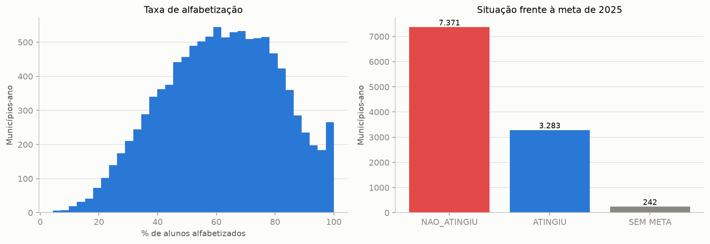
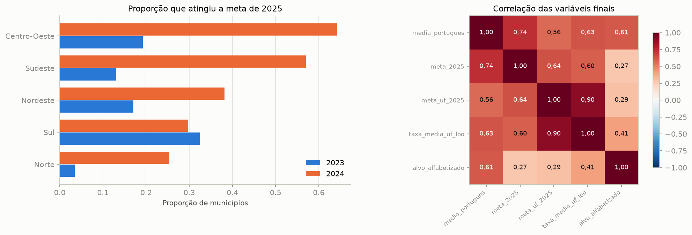
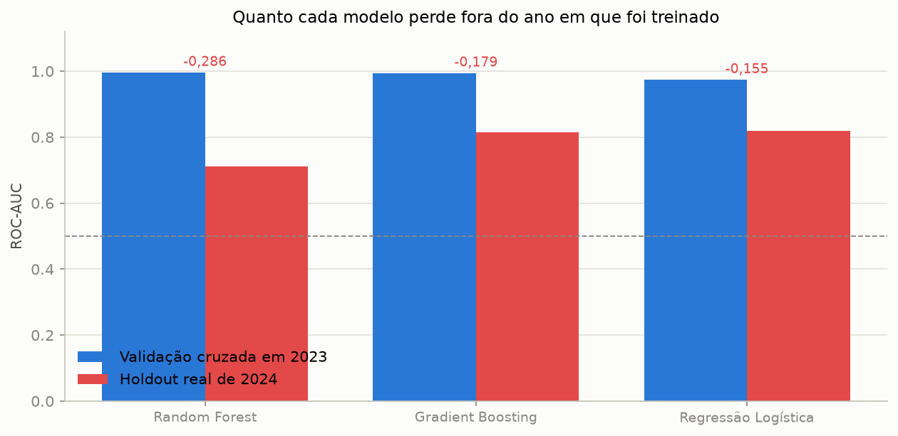
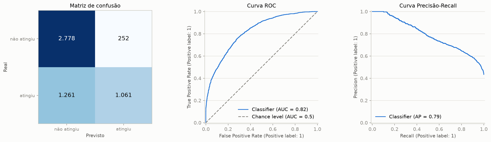
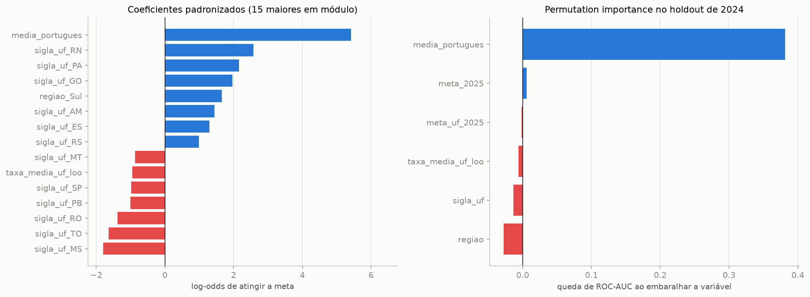
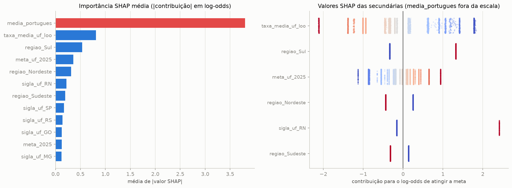
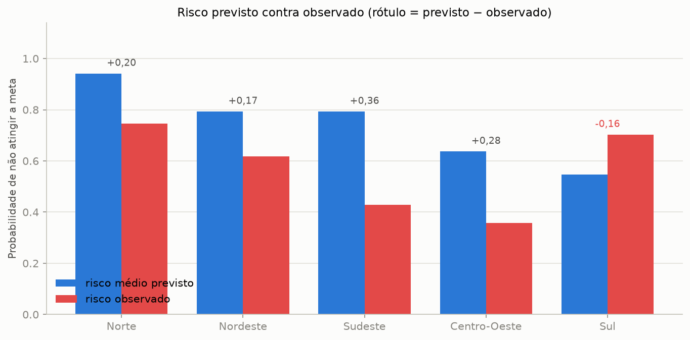

# Tech Challenge - Fase 3

## Predição e inteligência analítica para alfabetização no Brasil

Projeto acadêmico de Ciência de Dados que reproduz, em Python e pandas, a pipeline medalhão construída na Fase 2 e desenvolve um modelo supervisionado para classificar o risco educacional dos municípios brasileiros.

A solução foi deliberadamente simplificada para usar somente os cinco arquivos originais da Fase 2. As fontes externas são opcionais no enunciado e não participam desta versão.

**Recorte da entrega:** analisamos fatores por **município**, devido às limitações dos arquivos disponíveis. Eles não contêm ID de aluno, características individuais ou histórico que permita acompanhar uma criança. O código IBGE identifica o município. O resultado estima o atingimento de uma meta municipal e não pode ser convertido na chance de alfabetização de um aluno daquele lugar.

> ### O achado central
>
> Escolher o algoritmo pela validação cruzada dentro do ano de treino levaria ao **pior** modelo possível. O Random Forest alcança **ROC-AUC 0,996** em 2023 e desaba para **0,711** em 2024. A Regressão Logística, última entre os três algoritmos na validação cruzada (0,974), é a **melhor no ciclo seguinte** (0,819) e a que menos perde.
>
> A ordem dos modelos se inverte entre as duas medições. Num problema com dois ciclos e uma mudança grande de prevalência, **validação cruzada dentro de um único ano não mede generalização** — ela mede memorização. Ver [seção 5](#5-escolha-do-algoritmo).

## Sumário

1. [Contexto do problema](#1-contexto-do-problema)
2. [Objetivo analítico](#2-objetivo-analítico)
3. [Descrição da base utilizada](#3-descrição-da-base-utilizada)
4. [Etapas de modelagem](#4-etapas-de-modelagem)
5. [Escolha do algoritmo](#5-escolha-do-algoritmo)
6. [Métricas de avaliação](#6-métricas-de-avaliação)
7. [Interpretação dos resultados](#7-interpretação-dos-resultados)
8. [Insights encontrados](#8-insights-encontrados)
9. [Limitações do projeto](#9-limitações-do-projeto)
10. [Aplicação prática para políticas públicas](#10-aplicação-prática-para-políticas-públicas)
11. [Possíveis evoluções futuras](#11-possíveis-evoluções-futuras)
12. [Perguntas norteadoras](#12-respostas-às-perguntas-norteadoras)
13. [Reprodução](#13-como-reproduzir)

---

## 1. Contexto do problema

A alfabetização infantil é um indicador central do desenvolvimento educacional e social. Conhecer somente a situação corrente não é suficiente para orientar recursos públicos: gestores precisam identificar territórios vulneráveis, compreender padrões regionais e priorizar municípios que demandam acompanhamento.

O Tech Challenge propõe transformar os dados produzidos pela pipeline da Fase 2 em análise exploratória, modelagem supervisionada e inteligência aplicável à tomada de decisão.

Há uma restrição essencial: os arquivos disponíveis não contêm microdados de alunos. A menor granularidade é **município × ano × rede de ensino**. Consequentemente, este trabalho não prevê se uma criança específica será alfabetizada.

---

## 2. Objetivo analítico

O objetivo técnico é estimar a probabilidade de uma rede municipal atingir sua meta de alfabetização, usando variáveis educacionais e territoriais existentes nos dados da Fase 2.

### Unidade de análise

- Uma observação representa um município, em um ano, na rede municipal.
- Treino: ciclo de 2023.
- Teste temporal: ciclo de 2024.

### Variável-alvo

A variável **alvo_alfabetizado** é uma proxy municipal:

- **1 - atingiu a meta:** taxa municipal observada maior ou igual à meta municipal de 2025;
- **0 - não atingiu a meta:** taxa observada abaixo da meta;
- municípios sem meta publicada são excluídos da modelagem.

A interpretação correta é **probabilidade de atingimento da meta municipal**. Não se trata de probabilidade individual de alfabetização.

### Saída operacional

Para priorização pública, o risco é calculado por:

    probabilidade de risco = 1 - probabilidade de atingir a meta

O resultado final é um ranking municipal para triagem, disponível em [reports/ranking_risco_2024.csv](reports/ranking_risco_2024.csv).

---

## 3. Descrição da base utilizada

### 3.1 Fontes originais

Os dados têm origem no INEP e foram obtidos na plataforma **Base dos Dados**, conforme a documentação da Fase 2. Os cinco CSVs foram versionados em `dados/` naquele projeto e reaproveitados em `data/` nesta fase. A execução atual lê esses arquivos locais, reconstrói Bronze, Silver e Gold em Python/pandas e usa a Gold como origem da preparação analítica. Não depende de baixar dados ou consultar a AWS durante a execução.

Foram utilizados somente os cinco CSVs herdados da Fase 2:

| Entidade | Registros brutos | Conteúdo | Tem ID de aluno? |
|---|---:|---|---|
| Indicador por município | 23.995 | taxa, média de Português e níveis de proficiência | não |
| Indicador por UF | 145 | indicadores agregados estaduais | não |
| Metas Brasil | 3 | metas nacionais | não |
| Metas por UF | 54 | metas estaduais | não |
| Metas por município | 10.704 | metas e níveis municipais | não |

Nenhuma das cinco fontes desce abaixo do grão município × ano × rede. É isso que torna o recorte municipal uma consequência dos dados, e não uma escolha de conveniência.

As planilhas mantidas em `data/external` não são lidas por nenhum módulo da pipeline atual.

**Não usamos fontes externas de enriquecimento.** A plataforma que disponibilizou os CSVs originais não representa uma fonte adicional de atributos. UF e região são derivadas do código municipal com um mapeamento no código. Não foram adicionados renda, investimento, infraestrutura, formação docente ou registros de políticas públicas.

### Contexto socioeconômico e político

A análise considera o território em que as crianças estudam para investigar diferenças de desempenho entre municípios. Condições socioeconômicas e políticas educacionais são hipóteses relevantes para explicar essas diferenças, mas **não foram medidas diretamente na base utilizada**. As variáveis UF e região podem refletir vários fatores não observados, sem identificar qual deles explica o resultado.

Portanto, não concluímos que uma política específica ou a renda determina se um aluno será alfabetizado. Usamos os indicadores educacionais e territoriais disponíveis para classificar a situação municipal e indicar onde aprofundar o diagnóstico. Atribuir o resultado agregado a uma criança seria uma **falácia ecológica**.

### 3.2 Reimplementação da arquitetura medalhão

| Aspecto | Fase 2 | Reimplementação local |
|---|---|---|
| Processamento | AWS Glue e Spark | Python e pandas |
| Armazenamento | Amazon S3 | Parquet local |
| Consulta | Athena | pandas |
| Particionamento | ano=YYYY | ano=YYYY |
| Camadas | Bronze, Silver e Gold | Bronze, Silver e Gold |
| Fontes | cinco CSVs | os mesmos cinco CSVs |

A pipeline gera:

| Visão Gold | Registros | Finalidade |
|---|---:|---|
| alfabetizacao_por_municipio | 10.896 | análise municipal e construção do alvo |
| evolucao_temporal | 49 | evolução por UF e ano |
| ranking_municipios | 10.896 | posição do município dentro da UF |
| comparacao_metas_nacionais | 1 | comparação disponível no recorte nacional |

As quatro visões e o dataset de modelagem foram comparados programaticamente com o projeto de referência e apresentaram conteúdo idêntico, desconsiderando metadados de execução e a ordem física da coluna de partição.

### 3.3 Dataset final de modelagem

A seleção ocorre somente depois do diagnóstico de leakage realizado na EDA. O arquivo [data/features/dataset_modelagem.parquet](data/features/dataset_modelagem.parquet) possui **10.654 registros e 9 colunas**:

| Papel | Colunas |
|---|---|
| Identificação | id_municipio, ano |
| Numéricas | media_portugues, meta_2025, meta_uf_2025, taxa_media_uf_loo |
| Categóricas | sigla_uf, regiao |
| Alvo | alvo_alfabetizado |

---

## 4. Etapas de modelagem

### 4.1 Análise exploratória

A EDA investiga distribuição, ausência de dados, evolução temporal, padrões regionais, correlações e risco de leakage.

A taxa de alfabetização ocupa praticamente toda a escala de 0% a 100%. A maior parte das observações município-ano não atingiu a meta; 242 registros não possuíam uma meta municipal válida e, portanto, não receberam alvo.

### 4.2 Tratamento de data leakage

A pipeline Bronze -> Silver -> Gold preserva todas as variáveis. A exclusão acontece apenas na etapa analítica, depois de justificada pela EDA.

Não entram como features:

| Coluna | Motivo |
|---|---|
| taxa_alfabetizacao | participa diretamente da definição do alvo |
| gap_meta_2025 | função da taxa e da meta |
| status_meta_2025 | origem direta do rótulo |
| nivel_alfabetizacao | discretização da taxa |
| proporcao_aluno_nivel_0 a 8 | decomposição da mesma avaliação (correlação 0,986 com a taxa) |
| id_municipio | identificador, sem significado ordinal |
| ano | usado para o split temporal |

A variável **taxa_media_uf_loo** usa média leave-one-out: a taxa do próprio município é removida do cálculo estadual.

#### O vazamento residual, medido

Existe uma limitação residual importante, e ela foi quantificada em vez de apenas declarada. `media_portugues` correlaciona **0,93** com a taxa de alfabetização nos dois ciclos, e `meta_2025` é literalmente um dos lados da desigualdade que define o rótulo.

Uma regra **sem nenhum classificador** — ajustar a taxa em função da nota de Português em 2023 e comparar o valor estimado com a meta — acerta **84,1% em 2023 e 87,1% em 2024**, acima da acurácia do modelo completo (71,7%).

Isso não invalida o trabalho, mas fixa a interpretação: o exercício é uma **classificação contemporânea (nowcast)** de um ciclo já avaliado, não uma previsão *ex ante*. Manter `media_portugues` segue o projeto de referência e é defensável — a nota é uma medida psicométrica distinta da taxa, numa escala de proficiência, não um percentual —, mas a distância de 0,93 é pequena demais para chamar o resultado de antecipação.

### 4.3 Engenharia e transformação das variáveis

O pré-processamento é integrado ao Pipeline do Scikit-learn:

- variáveis numéricas: imputação pela mediana e padronização;
- variáveis categóricas: imputação pela moda e one-hot encoding;
- categorias desconhecidas no teste: ignoradas pelo encoder;
- todas as transformações são ajustadas somente nos dados de treino de cada fold.

A figura mostra dois pontos relevantes:

- todas as regiões melhoram entre os ciclos, **exceto o Sul**, que recua de 32,4% para 29,7% — a única a piorar, enquanto Centro-Oeste e Sudeste mais que triplicam;
- `media_portugues` tem a maior correlação linear com o alvo (0,61), e `meta_uf_2025` e `taxa_media_uf_loo` correlacionam 0,90 entre si, indicando redundância territorial.

### 4.4 Treino, validação e teste

- Treino temporal: 5.302 registros de 2023 (prevalência do alvo: 18,1%).
- Holdout temporal: 5.352 registros de 2024 (prevalência: 43,4%).
- Validação interna: StratifiedKFold com cinco folds, somente em 2023.
- Otimização: GridSearchCV sobre o parâmetro C da Regressão Logística, com `return_train_score` para expor o gap treino-validação.
- Semente aleatória: 42.
- O holdout de 2024 não participa do ajuste nem da escolha de hiperparâmetros.

O projeto executa **duas comparações independentes** entre algoritmos: uma por validação cruzada apenas em 2023 ([reports/comparacao_modelos_cv2023.csv](reports/comparacao_modelos_cv2023.csv)) e outra no holdout de 2024 ([reports/comparacao_modelos.csv](reports/comparacao_modelos.csv)). Elas discordam, e a discordância é o principal achado metodológico da entrega — tratado na seção seguinte.

---

## 5. Escolha do algoritmo

### 5.1 A comparação que não vê o futuro

Primeiro, a comparação metodologicamente correta para *escolher*: validação cruzada de cinco folds, inteiramente dentro de 2023.

| Modelo | ROC-AUC (val.) | PR-AUC (val.) | F1 (val.) | Gap treino-val. |
|---|---:|---:|---:|---:|
| Random Forest | **0,996** | **0,992** | 0,979 | 0,003 |
| Gradient Boosting | 0,994 | 0,981 | **0,980** | 0,005 |
| Regressão Logística | 0,974 | 0,916 | 0,796 | **0,003** |
| Baseline (classe majoritária) | 0,500 | 0,181 | 0,000 | 0,000 |

Os ensembles parecem imbatíveis, e o gap treino-validação é baixo em todos: **a validação cruzada não acusa sobreajuste**. Pelo procedimento-padrão, levaríamos o Random Forest.

### 5.2 O que acontece no ciclo seguinte

| Modelo | ROC-AUC CV 2023 | ROC-AUC holdout 2024 | Queda |
|---|---:|---:|---:|
| Random Forest | 0,996 | 0,711 | **−0,286** |
| Gradient Boosting | 0,994 | 0,816 | −0,179 |
| **Regressão Logística** | 0,974 | **0,819** | **−0,155** |
| Baseline | 0,500 | 0,500 | 0,000 |

**A ordem se inverte.** O primeiro colocado em 2023 é o último em 2024.

A causa está na natureza do alvo. Como `alvo = taxa >= meta_2025`, e as features contêm `meta_2025` (um lado da desigualdade) e `media_portugues` (correlação 0,93 com o outro lado), um modelo flexível **reconstrói a fronteira de decisão dentro de um ano** — daí o 0,996. Como a relação entre nota e taxa se desloca entre os ciclos, junto com a prevalência (18,1% → 43,4%), a fronteira memorizada não transfere. A Regressão Logística, sendo aditiva e regularizada, não consegue memorizar essa interação e por isso generaliza melhor.

### 5.3 Modelo escolhido

**Regressão Logística**, `class_weight="balanced"`, **C = 1,0**:

- melhor desempenho no ciclo nunca visto, que é o critério alinhado ao uso pretendido;
- menor queda entre validação e holdout;
- coeficientes com direção e magnitude interpretáveis, o que a seção 7 explora;
- menor complexidade operacional.

A grade de `C` confirma que a regularização não é o gargalo: o gap treino-validação nunca passa de **0,004** em nenhum ponto, e apenas `C = 0,01` degrada o F1 (−0,034). A regularização aqui é salvaguarda contra a redundância territorial, não remédio para memorização.

---

## 6. Métricas de avaliação

### 6.1 Resultado no holdout de 2024

| Métrica | Valor | Interpretação |
|---|---:|---|
| Acurácia | 0,7173 | contra baseline de **0,5661** (sempre prever "não atingiu") |
| Precisão da classe atingiu | 0,8081 | quando prevê atingimento, acerta 80,8% |
| Recall da classe atingiu | 0,4569 | identifica somente 45,7% dos que atingiram |
| F1 da classe atingiu | 0,5838 | equilíbrio entre precisão e recall da classe 1 |
| ROC-AUC | 0,8191 | boa capacidade de ordenação entre as classes |
| PR-AUC | 0,7878 | qualidade da classe positiva considerando sua prevalência |

### 6.2 Leitura da matriz de confusão

| Resultado | Municípios |
|---|---:|
| Não atingiu e foi previsto como não atingiu | 2.778 |
| Não atingiu, mas foi previsto como atingiu | 252 |
| Atingiu, mas foi previsto como não atingiu | 1.261 |
| Atingiu e foi previsto como atingiu | 1.061 |

Embora as métricas publicadas usem **atingiu a meta** como classe positiva, a política pública se interessa principalmente pela classe de risco. No limiar de 0,5:

- o modelo encontra **91,7% dos municípios que efetivamente não atingiram a meta**;
- sinaliza 4.039 municípios;
- aproximadamente **68,8%** dos sinalizados realmente não atingiram a meta.

Isso favorece triagem com alta cobertura, mas produz muitos falsos alertas.

### 6.3 Calibração: o escore ordena, mas não mede

O desvio médio entre probabilidade prevista e frequência observada é de **0,193**. O modelo subestima sistematicamente o atingimento em 2024 — esperado, já que foi treinado num ano com 18,1% de prevalência e aplicado num ano com 43,4%.

**Consequência prática:** a ordenação dos municípios é utilizável (ROC-AUC 0,819), mas o **valor** da probabilidade não deve ser publicado como "chance real" sem recalibração. É a justificativa quantitativa para tratar a saída como ranking de triagem.

---

## 7. Interpretação dos resultados

O enunciado recomenda Feature Importance e SHAP Values. O projeto aplica **três lentes** sobre o mesmo modelo ajustado, e a divergência entre elas é informativa.

### 7.1 Coeficientes e permutation importance

Pelos **coeficientes**, `media_portugues` domina (5,42), seguida por um bloco de dummies estaduais (RN 2,57; PA 2,16; GO 1,97).

Pela **permutation importance medida no holdout de 2024**, o quadro muda:

| Variável | Queda de ROC-AUC ao embaralhar |
|---|---:|
| media_portugues | **+0,3815** |
| meta_2025 | +0,0059 |
| meta_uf_2025 | −0,0016 |
| taxa_media_uf_loo | −0,0063 |
| sigla_uf | −0,0133 |
| regiao | −0,0276 |

Apenas `media_portugues` e `meta_2025` contribuem de fato. As quatro variáveis territoriais têm importância **negativa**: embaralhá-las **melhora** o ROC-AUC no ciclo seguinte. O bloco territorial ajusta um padrão regional de 2023 que não se repete em 2024 e, na prática, atrapalha a generalização.

### 7.2 SHAP Values

O SHAP confirma a ordem e revela a magnitude da assimetria:

| Variável | Contribuição SHAP média (log-odds) |
|---|---:|
| media_portugues | **3,7994** |
| taxa_media_uf_loo | 0,8112 |
| regiao_Sul | 0,5350 |
| meta_uf_2025 | 0,3565 |
| regiao_Nordeste | 0,3129 |
| sigla_uf_RN | 0,2180 |

`media_portugues` contribui quase cinco vezes mais que a segunda colocada; nenhuma dummy de UF passa de 0,22. A dominância é tão grande que a variável precisou ficar fora do painel de dispersão — seus valores individuais chegam a 25 em log-odds e achatariam as demais contra o zero.

**As três lentes convergem:** a nota de Português é o modelo. O restante ajusta margens, e o bloco territorial ajusta margens que não sobrevivem à troca de ciclo.

### 7.3 Mudança temporal

A proporção de municípios que atingiu a meta mudou fortemente:

| Ano | Municípios | Atingiu a meta |
|---|---:|---:|
| 2023 | 5.302 | 18,1% |
| 2024 | 5.352 | 43,4% |

Essa mudança de 25,3 pontos percentuais altera a distribuição do alvo entre treino e teste e explica boa parte dos erros do modelo.

### 7.4 Risco regional previsto contra observado

| Região | Municípios | Risco previsto | Risco observado | Diferença |
|---|---:|---:|---:|---:|
| Norte | 425 | 94,1% | 74,6% | +0,20 |
| Nordeste | 1.756 | 79,3% | 61,9% | +0,17 |
| Sudeste | 1.614 | 79,3% | 42,9% | **+0,36** |
| Centro-Oeste | 464 | 63,7% | 35,8% | +0,28 |
| Sul | 1.093 | 54,6% | 70,3% | **−0,16** |

O modelo superestima o risco em quatro regiões e **subestima no Sul** — justamente a única região que piorou entre os ciclos. O erro maior está no Sudeste (+0,36), que melhorou muito e não foi acompanhado.

---

## 8. Insights encontrados

### Insight 1 - Validação cruzada dentro de um ano é enganosa neste problema

O Random Forest lidera a validação cruzada de 2023 com ROC-AUC 0,996 e é o pior modelo em 2024 (0,711). A ordem dos três algoritmos se inverte entre as duas medições. Um gap treino-validação baixo **não** garantiu generalização, porque o deslocamento é entre ciclos, não entre folds.

### Insight 2 - O alvo é quase reconstruível sem modelo

Uma regra determinista usando apenas a nota de Português e a meta municipal acerta 87,1% em 2024, acima da acurácia do modelo (71,7%). É a evidência de que o exercício é nowcast, não previsão.

### Insight 3 - A melhora nacional não foi homogênea

| Região | 2023 | 2024 |
|---|---:|---:|
| Centro-Oeste | 19,3% | 64,2% |
| Sudeste | 13,0% | 57,1% |
| Nordeste | 17,1% | 38,2% |
| Sul | 32,4% | 29,7% |
| Norte | 3,5% | 25,4% |

O Sul foi a única região com redução na proporção de municípios que atingiu a meta — e é exatamente onde o modelo subestima o risco.

### Insight 4 - O território atrapalha a generalização

As dummies estaduais têm coeficientes altos, mas permutation importance **negativa** no ciclo seguinte. Elas capturam uma geografia de 2023 que 2024 não reproduz. É um argumento empírico, não estilístico, para testar a remoção de variáveis redundantes.

### Insight 5 - Português é a variável mais associada ao alvo

`media_portugues` domina correlações, coeficientes, permutation importance e SHAP. O resultado é esperado porque a alfabetização é construída a partir da mesma avaliação educacional. Isso torna a variável útil para classificação contemporânea, mas fraca para antecipação.

### Insight 6 - O modelo prioriza cobertura, não precisão operacional

No corte de 0,5, são sinalizados 4.039 dos 5.352 municípios, cobrindo 91,7% do risco real com 68,8% de precisão. Subir o corte para 0,9 reduz a lista a 3.136 e eleva a precisão a 75,6%, ao custo de 14 pontos de cobertura. O limiar deve ser escolhido conforme a capacidade real de atendimento.

---

## 9. Limitações do projeto

1. **Ausência de microdados:** os arquivos não têm ID, características ou trajetória de alunos. O modelo descreve municípios, não probabilidades individuais.
2. **Proxy do alvo:** atingir a meta de 2025 não equivale à definição individual de alfabetização.
3. **Somente dois ciclos:** uma única transição temporal, sem validação em janelas múltiplas.
4. **Vazamento residual assumido:** `media_portugues` correlaciona 0,93 com a taxa e `meta_2025` define um lado do rótulo; uma regra sem modelo acerta 87,1%. A solução é nowcast, não previsão anterior à avaliação.
5. **Drift temporal:** a prevalência do alvo muda de 18,1% para 43,4%.
6. **Calibração insuficiente:** desvio médio de 0,193 entre probabilidade prevista e frequência observada.
7. **Território prejudica a generalização:** quatro das seis variáveis têm permutation importance negativa em 2024.
8. **Sem fontes socioeconômicas externas:** renda, população, infraestrutura e formação docente não estão no modelo.
9. **Sem alavancas acionáveis:** nenhuma variável do modelo é um instrumento de política pública.
10. **Sem inferência causal:** coeficientes e importâncias não comprovam impacto de políticas.
11. **Identificação limitada:** a base contém código IBGE, mas não nome do município.
12. **Meta variável:** usar uma meta municipal no alvo muda o limiar de classificação entre municípios.
13. **Validação cruzada não é suficiente aqui:** como a seção 5 mostra, ela seleciona o pior modelo. A escolha final apoia-se no holdout de 2024, o que significa que **um terceiro ciclo ainda é necessário** para uma avaliação completamente independente de todas as decisões.

---

## 10. Aplicação prática para políticas públicas

O modelo pode apoiar:

- triagem inicial de municípios;
- definição de prioridades para visitas e assistência técnica;
- acompanhamento regional;
- seleção de territórios para análises qualitativas;
- construção de cenários conforme a capacidade de atendimento.

Não deve ser usado para:

- classificar ou punir alunos;
- distribuir recursos automaticamente;
- avaliar causalmente uma política;
- comparar gestores sem contexto;
- publicar o valor do escore como probabilidade real, dada a calibração medida;
- tratar semelhança de escore regional como semelhança educacional.

### Uso recomendado

1. O gestor define quantos municípios consegue acompanhar.
2. O corte de risco sai dessa capacidade, não de 0,5.
3. O ranking fornece uma ordem inicial de análise.
4. A equipe combina o escore com dados administrativos locais.
5. Casos inconsistentes são revisados manualmente.
6. O resultado real do próximo ciclo é usado para monitorar drift e recalibrar o modelo.

---

## 11. Possíveis evoluções futuras

### Dados

- incorporar um terceiro ciclo comparável, que permitiria validação temporal repetida;
- usar apenas variáveis disponíveis antes do ciclo previsto, transformando nowcast em previsão;
- adicionar nomes municipais por tabela oficial de códigos;
- testar enriquecimento opcional com IBGE, Censo Escolar, FUNDEB e PNAD;
- criar variáveis de política educacional e capacidade da rede, que são as alavancas que faltam.

### Modelagem

- redefinir **risco** como classe positiva para alinhar métricas ao negócio;
- calibrar probabilidades com CalibratedClassifierCV, atacando o desvio de 0,193;
- remover o bloco territorial e medir o efeito, dado que sua permutation importance é negativa;
- otimizar o limiar por orçamento e custo de falsos negativos;
- medir métricas por região e UF, dado que o erro é regionalmente heterogêneo;
- adicionar intervalos de confiança por bootstrap;
- monitorar drift de features, alvo e calibração.

### Governança

- criar ficha de dados e política de atualização;
- registrar versão das fontes e data de referência;
- estabelecer revisão humana obrigatória;
- publicar critérios de uso, contestação e monitoramento.

---

## 12. Respostas às perguntas norteadoras

### Quais fatores mais impactam a alfabetização?

Dentro do modelo, `media_portugues` é dominante nas três lentes: coeficiente 5,42, queda de 0,38 de ROC-AUC na permutation importance e contribuição SHAP média de 3,80 — quase cinco vezes a segunda colocada. O resultado mede associação preditiva, e a associação é forte em boa medida porque a nota e a taxa medem o mesmo desempenho no mesmo ciclo. A base não permite concluir que elevar isoladamente uma dessas variáveis causará melhoria na alfabetização.

### Quais municípios apresentam maior risco educacional?

O ranking completo está em [reports/ranking_risco_2024.csv](reports/ranking_risco_2024.csv). Os primeiros códigos são predominantemente de Tocantins, Sergipe, Bahia e Paraíba. Como as probabilidades estão descalibradas (desvio 0,193), a lista deve iniciar uma investigação, não encerrá-la — vale a ordem, não o valor.

### Quais regiões possuem padrões semelhantes?

Pelo escore do modelo, Nordeste e Sudeste formam um par (risco previsto de 79,3% em ambos). **Essa semelhança é um artefato, não um padrão educacional:** no resultado observado, o risco do Sudeste é de 42,9% contra 61,9% do Nordeste. O modelo reproduz a geografia de 2023. Esta é a pergunta que o trabalho responde pior, e responder bem exigiria recalibração por ciclo ou variáveis de contexto ausentes na base.

### Como prever municípios que podem não atingir metas futuras?

A implementação atual **não** responde rigorosamente a essa pergunta, porque utiliza indicadores do mesmo ciclo. Ela classifica um ciclo já avaliado. Para previsão futura seriam necessárias features exclusivamente defasadas, pelo menos três ciclos comparáveis e validação em um ciclo posterior nunca usado — dois desses três requisitos falham hoje.

### Quais variáveis possuem maior influência nos modelos?

`media_portugues`, com folga, seguida por `meta_2025`. As variáveis territoriais têm coeficientes grandes mas contribuição **negativa** para a generalização, medida por permutation importance no holdout. A tabela completa está na seção 7 e em [reports/model_card.json](reports/model_card.json).

---

## 13. Como reproduzir

### Instalação

No PowerShell:

    python -m venv .venv
    .\.venv\Scripts\Activate.ps1
    pip install -r requirements.txt

### Pipeline de dados

    python -m src.preprocessing.run_pipeline

### Dataset de modelagem

    python -m src.preprocessing.build_features

### Treino, avaliação e artefatos reprodutíveis

    python -m src.modeling.model_card

Esse comando regenera `reports/model_card.json`, `reports/modelo_final.joblib`, `reports/comparacao_modelos.csv` e `reports/comparacao_modelos_cv2023.csv`. Todo número publicado neste README sai dele ou dos notebooks.

### Notebooks

Execute na ordem:

1. [01_pipeline_medalhao.ipynb](notebooks/01_pipeline_medalhao.ipynb) - Bronze, Silver e Gold
2. [02_analise_exploratoria.ipynb](notebooks/02_analise_exploratoria.ipynb) - EDA, leakage e seleção de variáveis
3. [03_modelagem.ipynb](notebooks/03_modelagem.ipynb) - comparação, otimização e interpretabilidade
4. [04_aplicacao_estrategica.ipynb](notebooks/04_aplicacao_estrategica.ipynb) - perguntas de negócio

---

## Estrutura principal

    data/
      br_inep_*.csv
      features/dataset_modelagem.parquet
      lake/
        bronze/
        silver/
        gold/
    images/
      02_distribuicao_indicador_proxy.png
      02_padroes_territoriais_correlacoes.png
      03_generalizacao_temporal.png
      03_avaliacao_modelo.png
      03_calibracao.png
      03_interpretabilidade_coeficientes.png
      03_shap_summary.png
      04_ranking_risco.png
      04_risco_por_regiao.png
    notebooks/
    reports/
      comparacao_modelos.csv
      comparacao_modelos_cv2023.csv
      model_card.json
      modelo_final.joblib
      ranking_risco_2024.csv
      relatorio_tecnico.md
    src/
      preprocessing/    pipeline medalhão e dataset de modelagem
      modeling/         alvo, features, pipeline sklearn e model card
      evaluation/       métricas, interpretabilidade e estratégia
      visualization/    estilo visual compartilhado

## Artefatos técnicos

- [Relatório técnico](reports/relatorio_tecnico.md)
- [Model card](reports/model_card.json)
- [Comparação no holdout de 2024](reports/comparacao_modelos.csv)
- [Comparação por validação cruzada em 2023](reports/comparacao_modelos_cv2023.csv)
- [Ranking de risco](reports/ranking_risco_2024.csv)
