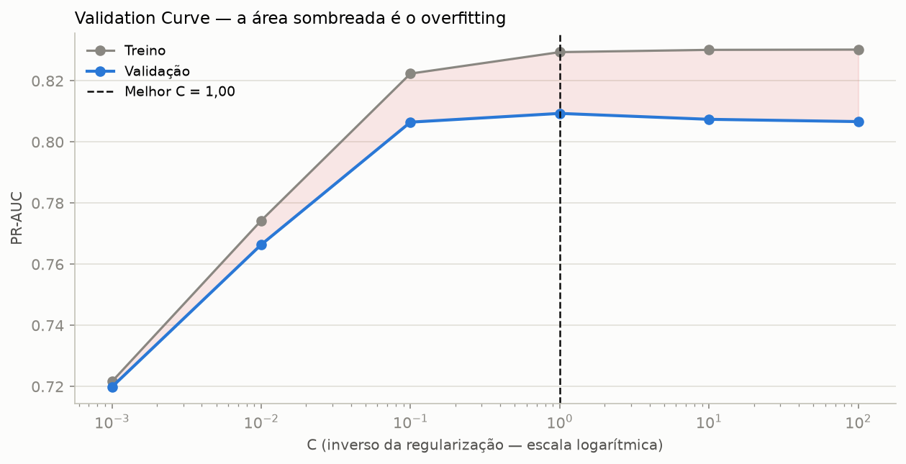
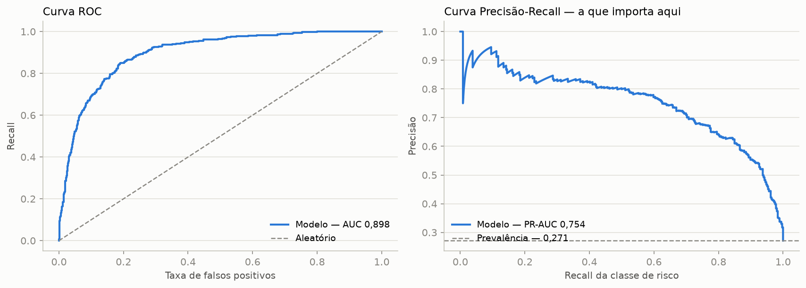
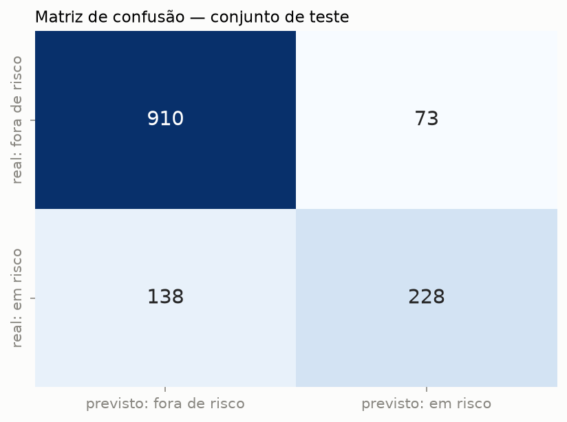
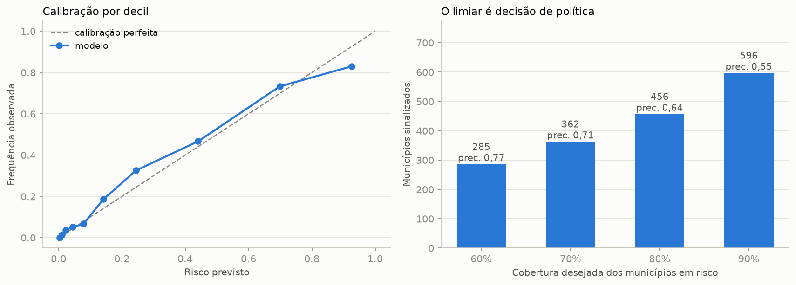
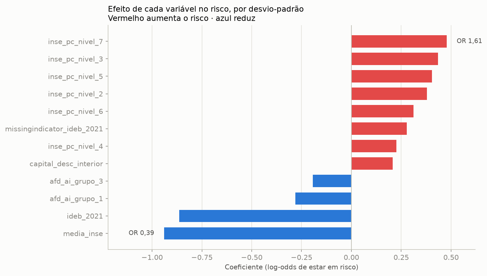
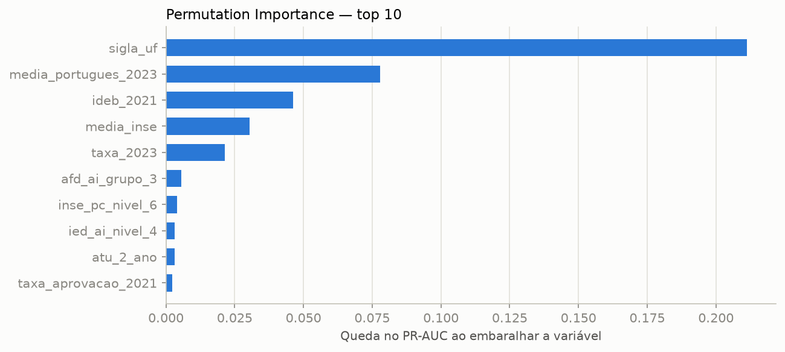
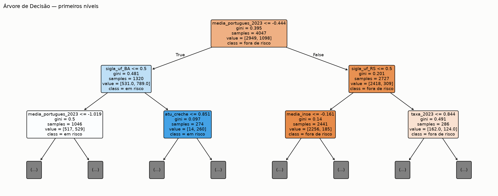
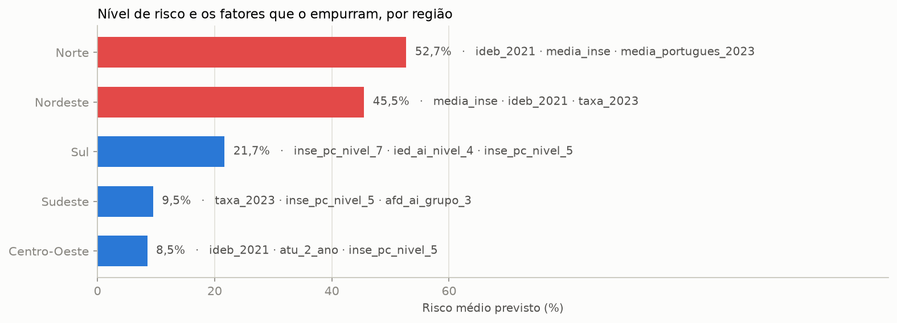
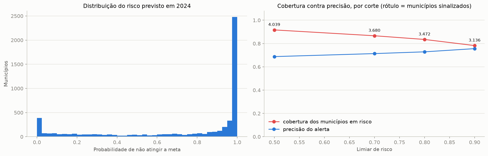

# Tech Challenge — Predição de Risco de Alfabetização nos Municípios Brasileiros

> **POSTECH AI Scientist — Fase 3.** Continuidade da pipeline de dados da Fase 2, agora aplicada
> a Machine Learning supervisionado.

Modelo supervisionado que prevê se **um município está em risco educacional** — isto é, se menos
da metade das suas crianças chega alfabetizada ao fim do 2º ano — a partir do **histórico** e da
**atualidade** daquele território.

**O achado central:** depois de controlar o desempenho pregresso da rede, o nível socioeconômico,
a formação docente, o tamanho das turmas, a ruralidade e o porte, **a unidade federativa continua
sendo o maior efeito do modelo**. Embaralhá-la derruba o PR-AUC em 0,211 — quase três vezes a
segunda colocada. Ceará (*odds ratio* de risco **0,19**) e Bahia (**6,96**) são vizinhos, da mesma
região e com condições socioeconômicas próximas, e aparecem em polos opostos. O que separa os
municípios brasileiros não é principalmente a renda das famílias: é a política pública que cada
estado executa.

---

## 1. Contexto do problema

O **Compromisso Nacional Criança Alfabetizada** pactua metas por município para que toda criança
esteja alfabetizada ao fim do **2º ano do ensino fundamental**. A régua é o **Indicador Criança
Alfabetizada (ICA)**: o percentual de estudantes que atingem **743 pontos na escala Saeb de
Língua Portuguesa**.

O indicador diz **onde estamos** — 62,8% na média da rede municipal em 2024. Não diz **por quê**,
nem **onde intervir primeiro**. E a média não descreve ninguém: há municípios com 4% e municípios
com 100%.

## 2. Objetivo analítico

Desenvolver um modelo supervisionado que preveja se um aluno será considerado **alfabetizado ou
não alfabetizado**, e usá-lo para responder a cinco perguntas de negócio:

1. Quais fatores mais impactam a alfabetização?
2. Quais municípios apresentam maior risco educacional?
3. Quais regiões possuem padrões semelhantes?
4. Como prever municípios que podem não atingir as metas futuras?
5. Quais variáveis possuem maior influência no modelo?

### A ponte entre o dado disponível e a pergunta

O enunciado pergunta pelo **aluno**. **Não existe microdado público de aluno** em nenhuma das
fontes: INEP, Censo Escolar, INSE e IDEB são todos agregados municipais, sem identificador de
estudante.

| Fonte | Grão mais fino | Tem identificador de aluno? |
|---|---|---|
| Indicador Criança Alfabetizada (INEP) | município × ano × série × rede | não |
| Censo Escolar — AFD, ATU, IED | município × ano × localização | não |
| Saeb — INSE | município × tipo de rede × localização | não |
| IDEB Anos Iniciais | município × rede × ciclo | não |

Modelamos então **o contexto que responde por essa criança**: o município entra como *em risco*
quando `taxa_alfabetizacao < 50%`. A leitura para a pergunta original é direta — *uma criança que
estuda num município sinalizado em risco tem chance substancialmente menor de ser considerada
alfabetizada*.

O município entra com **duas naturezas de informação**:

| Natureza | Variáveis | Por que é legítima |
|---|---|---|
| **Histórico** | taxa e nota de Português de **2023**, IDEB e aprovação de **2021** | anteriores ao ciclo previsto — já publicadas quando 2024 começou |
| **Atualidade** | nível socioeconômico, formação docente, esforço docente, tamanho de turma, ruralidade, porte, UF | descrevem o município, não o resultado da prova |

A contrapartida é a **falácia ecológica**: duas crianças do mesmo município recebem a mesma
predição (seção 9).

## 3. Descrição da base

| Origem | Conteúdo | Papel |
|---|---|---|
| **INEP / Base dos Dados** (5 CSVs) | Indicador Criança Alfabetizada e metas | alvo, histórico e metas |
| **Censo Escolar — AFD, ATU, IED** (2023, 2024) | formação docente, alunos por turma, esforço docente | atualidade |
| **Saeb — INSE** (2023) | nível socioeconômico municipal | atualidade |
| **IDEB Anos Iniciais** (ciclo 2021) | IDEB e taxa de aprovação | histórico |

O enriquecimento **não foi opcional**: sem ele, a maior correlação disponível com o alvo seria a
de `ano` (0,06); com ele, 0,53.

### Pipeline medalhão, reproduzida localmente

A arquitetura **Bronze → Silver → Gold** da Fase 2 (AWS Glue + S3 + Athena) foi reproduzida em
**Python/pandas, sem nuvem**, preservando schema explícito, hash de deduplicação, quarentena,
particionamento por ano e escrita idempotente.

| Camada | Resultado |
|---|---|
| **Bronze** | 10 entidades, **719.757 registros**, DQ 100% |
| **Silver** | **54.165 duplicatas removidas**, 890 registros em quarentena — todos do INSE, que repete a mesma chave até 7 vezes |
| **Gold** | 5 visões, com a `base_ml_alfabetizacao` (10.896 linhas × 38 colunas) |
| **Idempotência** | verificada nas três camadas, partição a partição |

**Painel de modelagem:** os **5.396 municípios** de 2024 que têm histórico de 2023 — 4 variáveis
de histórico, 24 de atualidade e 2 categóricas. **1.464 estão em risco (27,1%)**.

### Limitações da base

1. **Não há microdado de aluno** — nenhuma fonte desce abaixo do município.
2. **Só existem dois ciclos** (2023 e 2024), e um contém um choque exógeno: o Rio Grande do Sul
   caiu **20,2 p.p.** entre eles.
3. **Nenhuma variável de política educacional** — a base descreve o que o município *tem*, nunca
   o que ele *faz*.

## 4. Etapas de modelagem

### 4.1 Data leakage — medido, não presumido

O arquivo do INEP traz colunas que parecem excelentes preditoras e **são a mesma medição que gerou
o alvo**:

| Coluna | Correlação com o alvo |
|---|---:|
| `media_portugues` (2024) | **0,927** |
| soma das proporções por nível 5-8 | **0,986** |
| `meta_alfabetizacao_2025` | **0,966** |

São **23 colunas excluídas**, com o motivo de cada uma em
[`src/preprocessing/config.py`](src/preprocessing/config.py), removidas programaticamente por
`gold.montar_base_ml()` — e um `assert` no notebook 01 verifica que nenhuma sobreviveu.


**O critério não é a força da correlação**, e sim: *esta informação estaria disponível no momento
da predição?* Por isso a nota de Português de **2024** sai e a de **2023** fica. **Vazamento é
contemporâneo, não histórico.**

### 4.2 Pipeline do Scikit-learn

Todo o pré-processamento vive **dentro** do `Pipeline`, então cada estatística é calculada só com
o fold de treino:

| Ramo | Tratamento | Motivo |
|---|---|---|
| Numéricas | mediana → `StandardScaler` | escalas incomparáveis (de 3 a 80.160 contra 4 a 6): sem padronizar, a penalidade L2 puniria as variáveis pequenas |
| IDEB e aprovação | mediana **com `add_indicator=True`** | não ter IDEB divulgado é sinal, não ruído |
| Categóricas | moda → `OneHotEncoder(drop="first")` | remove uma categoria para evitar multicolinearidade |

### 4.3 Divisão e validação

`train_test_split` **estratificado** 75/25 — 4.047 municípios de treino e **1.349 de teste, que só
são tocados na avaliação final**. Sobre o treino, `StratifiedKFold` de 5 folds para comparar
algoritmos e ajustar hiperparâmetros, sempre com `return_train_score=True` para diagnosticar
overfitting.

## 5. Escolha do algoritmo

**Regressão Logística com regularização L2.** Não por simplicidade: ela venceu a comparação.

Os seis candidatos — os quatro da aula de classificação supervisionada mais os dois ensembles —
passaram pelo **mesmo** pré-processamento e pela mesma validação. Só o estimador muda.

| Modelo | ROC-AUC | PR-AUC | Recall (risco) | Gap treino-val. |
|---|---:|---:|---:|---:|
| **Regressão Logística** | **0,915** | 0,809 | 0,666 | **0,008** |
| Gradient Boosting | 0,912 | **0,813** | 0,664 | 0,061 |
| Random Forest | 0,910 | 0,810 | 0,585 | 0,059 |
| SVM (RBF) | 0,901 | 0,799 | 0,604 | 0,054 |
| Árvore de Decisão | 0,879 | 0,741 | 0,595 | 0,039 |
| Naive Bayes | 0,866 | 0,674 | 0,926 | 0,006 |
| Baseline (classe majoritária) | 0,500 | 0,271 | 0,000 | 0,000 |


A Regressão Logística **lidera o ROC-AUC**, fica a 0,004 do melhor PR-AUC — dentro do desvio entre
folds — e **sobreajusta sete vezes menos** que os ensembles. Entrega ainda probabilidade calibrada
e coeficientes que respondem *por quê*.

Dois resultados que valem mais que o pódio:

- **O Naive Bayes tem recall de 0,93 e precisão de 0,45**: dispara alarme para quase todo mundo. É
  o efeito esperado da premissa de independência aplicada aos três blocos composicionais (AFD, IED
  e níveis do INSE, que somam 100% cada).
- **O baseline acerta 72,9% sem prever ninguém em risco** — a prova de que acurácia sozinha não
  serve como critério.

### Otimização de hiperparâmetros

`GridSearchCV` sobre `C`, com `StratifiedKFold` e `scoring="average_precision"`:



`C = 1,0` vence com PR-AUC **0,809** e gap de **0,020** — muito abaixo do limiar de alerta de
0,05. A curva mostra treino e validação caminhando coladas: **não havia overfitting para
resolver.** Com 4.047 municípios de treino para 53 features num modelo linear, a penalidade L2 é
salvaguarda contra colinearidade residual, não remédio para sobreajuste.

## 6. Métricas de avaliação

A classe de risco é a **minoritária** (27,1%), e isso define o que reportamos:

| Métrica | O que responde |
|---|---|
| **Recall da classe de risco** | a prioritária: o erro caro é deixar de fora um município que precisa de apoio |
| **PR-AUC** | mais informativa que a ROC quando a classe de interesse é minoritária |
| **ROC-AUC** | o modelo ordena municípios por risco? |
| **Curva de calibração** | a probabilidade prevista é confiável, e não só a ordem? |
| *Acurácia* | reportada **sempre ao lado do baseline** de 72,9% |

### Resultado no conjunto de teste

1.349 municípios nunca vistos, tocados **uma única vez**:

| Métrica | Valor |
|---|---:|
| **ROC-AUC** | **0,898** |
| **PR-AUC** | **0,754** |
| Recall da classe de risco | 0,623 |
| Precisão da classe de risco | 0,758 |
| Acurácia | 0,844 |
| *Acurácia do baseline* | *0,729* |



Praticamente o mesmo da validação cruzada — não houve sobreajuste à partição. O ganho real sobre o
baseline é de **11,5 pontos de acurácia**.

## 7. Interpretação dos resultados

### Matriz de confusão



Os **228 verdadeiros positivos** são municípios em risco que o modelo encontrou; os **138 falsos
negativos** são os que ele deixou passar — e este é o erro caro. Os **73 falsos positivos** custam
uma visita técnica desnecessária.

### Quanto cada natureza de informação entrega

| Bloco | ROC-AUC | PR-AUC |
|---|---:|---:|
| Só histórico | 0,913 | **0,811** |
| Só atualidade | 0,889 | 0,759 |
| Histórico + atualidade | **0,915** | 0,809 |

**O histórico carrega quase todo o sinal preditivo** — sozinho ele empata com o modelo completo.
Isso **não** torna o bloco de atualidade descartável: ele é o único que responde *o que fazer*. O
histórico diz que o município vai mal; só o contexto diz que a formação docente ou o tamanho da
turma são as alavancas. **Um modelo só com histórico prevê e não explica.**

### Calibração



Desvio médio de **0,032**, com leve subestimação do risco na faixa intermediária. É calibração
suficiente para ler a saída como probabilidade — e é isso que permite compará-la com a meta
pactuada (seção 10).

### O que o modelo aprendeu




As três lentes convergem. Na *permutation importance*, embaralhar `sigla_uf` derruba o PR-AUC em
**0,211** — quase três vezes a segunda colocada (`media_portugues_2023`, 0,078) e sete vezes o
nível socioeconômico (0,031). Nos coeficientes, as dummies de UF ocupam as primeiras posições.

O Rio Grande do Sul aparece no polo de maior risco (*odds ratio* 14,98) por um motivo conhecido:
as enchentes de 2024, um choque conjuntural que o modelo lê como estrutura.

### Em pontos percentuais, para decisão


| Fator | Efeito no risco (+1 desvio-padrão) | Natureza |
|---|---:|---|
| Nota de Português de 2023 | **−6,1 p.p.** | condição herdada |
| IDEB 2021 | **−5,5 p.p.** | condição herdada |
| Nível socioeconômico | **−5,3 p.p.** | condição herdada |
| Taxa de 2023 | −4,4 p.p. | condição herdada |
| Formação docente adequada | **−2,4 p.p.** | alavanca escolar |

## 8. Insights encontrados

**1. A política estadual supera a condição socioeconômica.** Ceará e Pernambuco têm INSE idêntico
(4,37) e taxas de **90,1% contra 63,0%** — 27 pontos que a renda não explica.

**2. O efeito socioeconômico é, em boa parte, geográfico.** No agregado o INSE correlaciona 0,29
com o alvo; dentro das regiões: Norte 0,31 | Centro-Oeste 0,20 | Sul 0,04 | Sudeste 0,01 |
**Nordeste −0,14**. É um paradoxo de Simpson — o decil nacional de INSE é quase um rótulo de
região.


**3. O Rio Grande do Sul sofreu uma quebra estrutural em 2024** (−20,2 p.p., com 89,6% dos
municípios em queda). Como o ciclo modelado é 2024, **o risco previsto para o estado é pessimista
demais** — limitação declarada.

**4. A árvore de decisão redescobre sozinha os dois achados.**



A primeira divisão é a nota de Português de 2023; o segundo nível já usa dummies de UF. O
território aparece logo depois do histórico, antes de qualquer variável socioeconômica.

**5. Norte e Nordeste formam um par; as outras três regiões, não.**



| Região | Risco médio previsto | Motores do risco |
|---|---:|---|
| Norte | 52,7% | IDEB, INSE, nota de 2023 |
| Nordeste | 45,5% | INSE, IDEB, taxa de 2023 |
| Sul | 21,7% | composição do INSE, esforço docente |
| Sudeste | 9,5% | taxa de 2023, composição do INSE |
| Centro-Oeste | 8,5% | IDEB, tamanho de turma |

Norte e Nordeste compartilham patamar **e** motores. Onde o resultado já é alto, os motores deixam
de convergir — as restrições passam a ser locais.

## 9. Limitações

1. **Falácia ecológica** — o modelo descreve o município, não uma criança: duas crianças do mesmo
   lugar recebem a mesma predição. É consequência da ausência de microdado, não escolha de
   modelagem.
2. **Sem variáveis de política educacional** — o maior efeito do modelo (a UF) é justamente o que
   ele não consegue explicar.
3. **O ciclo de 2024 contém o choque do RS**, e o risco previsto para o estado é pessimista demais.
4. **25 das 27 UFs** — o DF não tem rede municipal e Roraima está ausente da fonte.
5. **INSE de 2023 replicado para 2024**; AFD/ATU/IED usam o agregado `Total`, que inclui a rede
   privada.
6. **Não projeta ciclos futuros** — descreve a estrutura de 2024.
7. **Associação, não causalidade.** Nenhuma intervenção se justifica só por estes coeficientes.
8. **O ranking não avalia gestão** — ordena municípios pelas condições observadas.

## 10. Aplicação prática para políticas públicas

### O limiar é decisão de política, não do software



O gestor define quanta cobertura quer, e o limiar sai daí. Adotando 80% de cobertura: **1.711
municípios prioritários**, com taxa média observada de 44,7%, contra 3.685 em acompanhamento, com
71,3%. Cobrir mais custa precisão — mais visitas técnicas a quem não precisava. **O modelo não
decide; ele mostra o câmbio.**

### Metas: de um número a uma decisão de orçamento

A meta pactuada **nunca entrou no modelo** — deriva da taxa de 2023 e seria vazamento. Cruzada com
o risco previsto depois da predição, ela separa dois grupos opostos:


| Situação | Municípios | Diagnóstico | Resposta |
|---|---:|---|---|
| Meta de 2025 já atingida | 2.314 (43,6%) | — | monitoramento |
| Abaixo da meta, **sem** sinal de risco | **1.692 (31,9%)** | falta execução | **apoio técnico**, retorno rápido |
| Abaixo da meta **com** sinal de risco | **1.296 (24,4%)** | faltam condições | **investimento estruturante**, retorno em anos |

Cobrar resultado do terceiro grupo sem mudar as condições é cobrar o impossível.

### Focalizar por perfil, não por território

Os padrões atravessam as fronteiras regionais: há municípios de perfil nordestino no interior do
Sudeste e o contrário. Um programa desenhado por região erraria o alvo — e o ranking de risco já
entrega a lista município a município.

### A recomendação de maior retorno

O maior ganho não está em nenhuma variável da base: está em **entender e replicar o que o Ceará
faz**. O modelo mede o tamanho do efeito sem conseguir explicá-lo. **A próxima rodada de dados
precisa registrar o que os estados fazem, não apenas o que eles têm.**

## 11. Evoluções futuras

1. **Variáveis de política educacional** — formação continuada, material estruturado, regime de
   colaboração. É o que transformaria o efeito da UF de inexplicável em explicável.
2. **Microdados de aluno**, se publicados, eliminariam a falácia ecológica.
3. **Terceiro ciclo avaliativo** permitiria separar tendência de choque e validar em duas
   transições temporais.
4. **Inferência causal** — diferenças-em-diferenças sobre a adoção de programas estaduais.
5. **Enriquecimento adicional**: FUNDEB, Cadastro Único, Atlas do Desenvolvimento Humano, PNAD.
6. **Monitoramento em produção** — *data drift* e PSI a cada novo ciclo, com re-treino versionado.

---

## Estrutura do repositório

```
├── data/                              # 5 CSVs do INEP + external/*.xlsx + lake/ (gitignored)
├── notebooks/
│   ├── 01_pipeline_medalhao.ipynb     # Bronze → Silver → Gold, DQ e idempotência
│   ├── 02_analise_exploratoria.ipynb  # EDA em 9 etapas, correlações e hipóteses
│   ├── 03_modelagem.ipynb             # 17 etapas: 6 modelos, GridSearchCV, SHAP
│   └── 04_aplicacao_estrategica.ipynb # as cinco perguntas de negócio
├── src/
│   ├── preprocessing/                 # pipeline medalhão local
│   ├── modeling/                      # painel, alvo e pipeline do modelo
│   ├── evaluation/                    # métricas e instrumentos de decisão
│   └── visualization/                 # estilo visual compartilhado
├── images/                            # figuras geradas pelos notebooks
├── reports/
│   ├── relatorio_tecnico.md
│   ├── model_card.json
│   └── ranking_risco_municipios.csv
├── requirements.txt · README.md · .gitignore
```

## Como executar

```bash
python -m venv .venv
.venv/Scripts/pip install -r requirements.txt

.venv/Scripts/python -m src.preprocessing.run_pipeline   # reconstrói o lake
.venv/Scripts/python -m src.modeling.model_card          # regenera o model card
.venv/Scripts/jupyter lab                                # notebooks 01 → 04
```

A pipeline é **idempotente** e nenhuma etapa exige credenciais, nuvem ou internet.

## Roteiro dos notebooks

| Notebook | Frente avaliada | Entrega |
|---|---|---|
| [01](notebooks/01_pipeline_medalhao.ipynb) | Engenharia de dados | 7 etapas: medalhão, DQ, quarentena, leakage e idempotência |
| [02](notebooks/02_analise_exploratoria.ipynb) | Análise exploratória | 9 etapas: da inspeção da base às hipóteses e decisões |
| [03](notebooks/03_modelagem.ipynb) | Modelagem supervisionada | 17 etapas: 6 modelos, `GridSearchCV`, validation curve, ROC, SHAP |
| [04](notebooks/04_aplicacao_estrategica.ipynb) | Aplicação estratégica | 6 etapas: as cinco perguntas respondidas pelo mesmo modelo |

Cada notebook segue o padrão das aulas: título de etapa numerado, célula de código com o
cabeçalho da etapa, e a leitura do resultado logo abaixo.

## Documentação técnica

| Artefato | Conteúdo |
|---|---|
| [`reports/relatorio_tecnico.md`](reports/relatorio_tecnico.md) | decisões, metodologia, o que foi descartado e as decisões revistas |
| [`reports/model_card.json`](reports/model_card.json) | ficha técnica **gerada por código** — proveniência, features, hiperparâmetros, métricas, limitações |
| [`reports/ranking_risco_municipios.csv`](reports/ranking_risco_municipios.csv) | a saída operacional: risco previsto dos 5.396 municípios |

O model card existe para que **nenhum número da documentação seja digitado à mão**.

## Tecnologias

**pandas + PyArrow** (pipeline medalhão em Parquet particionado) · **Scikit-learn** (`Pipeline`,
`ColumnTransformer`, `GridSearchCV`, os seis classificadores) · **SHAP** (interpretabilidade) ·
**Matplotlib + seaborn** (visualizações) · **openpyxl** (planilhas do INEP com cabeçalho
multi-nível).
